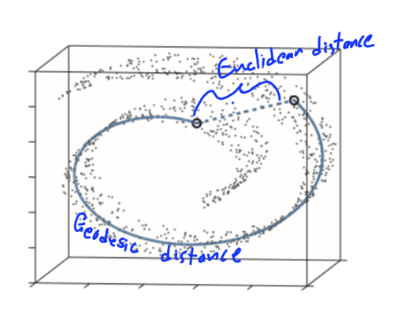
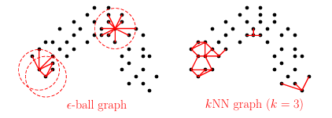

# What is a Manifold:

An $n$-dimensional manifold is a topological surface that resembles a Euclidean space locally at each point, or rather, each point has a neighborhood that is homeomorphic to an open subset of the $n$-dimensional Euclidean space.

A smooth manifold is essentially a manifold that is differentiable everywhere.

# Manifold Hypothesis:

Humans have many different ways of learning, but one that reflects the field of Manifold learning is how people use intuition to make complex concepts simpler, and thus easier to understand. The field of Manifold learning “assumes that the observed data lie on a low-dimensional manifold embedded in a higher-dimensional space.” The goal is to assume that really complex data that lives in a high-dimensional space has an inherent structure that is shared with that of a smooth manifold in a much lower dimension.
[Luke Melas-Kyriazi](https://arxiv.org/pdf/2011.01307)

# Important Math: 

## Tangent Space: 

A tangent space is defined as the span of the partial derivatives. This can be notated as $T_{p} M = { \frac{ \partial X }{ \partial u_{1} }, \frac{\partial X}{ \partial u_{2} }, … \frac{\partial X}{ \partial u_{n} } }$ for n dimensions.

## Induced Riemann Metric: 

"A Riemannian metric on a smooth manifold $ M $ is a smoothly varying choice of inner product $g_x : T_xM \times T_xM \to \mathbb{R}$ on each tangent space $T_xM$. For each $x\in M$, the bilinear form $g_x$ satisfies:

1. Symmetry: $g_x(u, v) = g_x(v, u)$ for all $u, v \in T_xM$.

2. Positive semidefiniteness: $g_x(u, u) \ge 0$ for all $u \in T_xM$.

3. Positive definiteness: $g_x(u, u) = 0$ iff $u = 0$." [Matt Koster](https://www.math.toronto.edu/mkoster/notes/Riemannian-Geometry.pdf)

Geodesic distance exists on Riemann Manifolds, which are smooth manifolds with a metric. The geodesic distance is the shortest distance between two points on the manifold. [Geodesics on Riemannian Manifolds UPENN](https://www.cis.upenn.edu/~cis6100/cis610-18-sl13.pdf)

## Laplace-Beltrami Operator: 

The Laplace-Beltrami Operator is an extension of the Laplace Operator onto Manifolds. Let $f: M \to \mathbb{R}$. Then the Laplace-Beltrami Operator is $\Delta_{ M } f = \mathrm{div}_{M} \nabla_{ M } f$, where $\Delta$ is the Laplace-Beltrami Operator, $f$ is the function on the manifold, div is the divergence operator, and $\nabla$ is the gradient operator ([Anastasia Dubrovina](https://graphics.stanford.edu/courses/cs233-18-spring/LectureSlides/2018-05-07_GeomLB.pdf)). This form has an implicit metric and works coordinate-free. The coordinate form is $\Delta_{M} f = -\frac{1}{\sqrt{|\det g|}} \sum_{i,j=1}^n \frac{\partial}{\partial x_i} \left( g^{ij} \sqrt{|\det g|} \frac{\partial}{\partial x_j} \right)$ ([Yaiza Canzani](https://www.math.mcgill.ca/toth/spectral\%20geometry.pdf)). Note that $det(g)$ is the determinant of the metric, and that $g^{ij}$ is the inverse of the matrix tensor $g_{ij}$. Given that the manifold is the mapping of $r(u_{1},u_{2},…,u_{n})$, we can define the matrix tensor as $g = \frac{\partial r}{\partial u_{i}} \cdot \frac{\partial r}{\partial u_{j}}$ where $i,j = 1,2,…,n$. For example, a 3D manifold would be represented by the tensor 

$$g = \left[
\begin{array}{ccc}
r_1\cdot r_1 & r_1\cdot r_2 & r_1\cdot r_3 \cr
r_2\cdot r_1 & r_2\cdot r_2 & r_2\cdot r_3 \cr
r_3\cdot r_1 & r_3\cdot r_2 & r_3\cdot r_3
\end{array}
\right]$$

# Multi-Dimensional Scaling (MDS)

Multi-Dimensional Scaling is a non-linear dimensionality reduction technique that focuses on preserving pairwise distances, the distances from a point to every other point. Dimension reduction just refers to simplifying higher-dimensional data, complex data with many input variables, into lower-dimensional spaces with fewer input variables while retaining the important information. There are multiple varieties of these, such as Classical MDS or Torgerson–Gower MDS, Principal Coordinates Analysis(PCoA), Metric multidimensional scaling(mMDS), Non-metric multidimensional scaling (NMDS), Generalized multidimensional scaling (GMD), and Super multidimensional scaling (SMDS); however, we will not be going over all of these in great detail ([Forrest W. Young, University of North Carolina](https://ccrma.stanford.edu/~unjung/mylec/mds.html)). 

# Isomap

Isometric mapping is a form of MDS that focuses on preserving Geodesic distance rather than Euclidean distance. Note that Geodesic distance is the closest distance between two points on the manifold, while Euclidean distance is the closest distance between two points in space.

[Aviral Agrawal and Theodore LaGrow](https://sites.gatech.edu/omscs7641/2024/03/10/no-straight-lines-here-the-wacky-world-of-non-linear-manifold-learning/)

Because Geodesic distances are often difficult and impractical to find, we can instead use approximation techniques to find the Geodesic distances. To get these approximations, we first want to build a “neighborhood graph”. We want to build this graph by only connecting “close” points with “edges weighted by their Euclidean distances”. This is represented by $d_{X} (i,j) = \lVert x_{i} - x_{j} \rVert$. Here we will define closeness to be one of two ways: the $\epsilon$-radius method and the $kNN$ method. [Guangliang Chen](https://www.sjsu.edu/faculty/guangliang.chen/Math253S20/lec10ISOmap.pdf)

Suppose we want to find the points close to point $A$. We can draw a circle centered at $A$ with radius $\epsilon$. The $\epsilon$-radius method defines all points within this radius as being close to $A$. Thus, all $x_{i}$ points close to $A$ must satisfy $\lVert A - x_{i} \rVert \leq \epsilon$.

Now, let’s say we are trying to find a point around point $B$. The $kNN$ method works by counting the $k$ closest points to $B$; those $k$ points are close to $B$.

[Guangliang Chen](https://www.sjsu.edu/faculty/guangliang.chen/Math253S20/lec10ISOmap.pdf)

We now want to form the Geodesic distance matrix, $D = [d_{ij}]$, where each $d_{ij}$ is the length of the Geodesic distance between every pair of points. This is typically referred to as the “all‑pairs shortest‑path matrix”. We can calculate this matrix using Dijkstra’s Algorithm. First, we must set a distance of one $x_{i}$ to 0. Then we can set the rest of the points to $+ \infty$, which just represents a large distance from $x_{i}$ to all of the other points. Then we select an “unvisited” point $x_{j}$ with the smallest tentative distance to $x_{i}$, finalizing the distance for this point and making it “visited”. Then we can do what is referred to as “relaxing the edges”, which essentially updates the neighbors about whether going through the point $x_{j}$ produces a shorter path. This is repeated until the shortest path from each point to $x_{i}$ is discovered, forming the $i \text{th}$ row of $D$. This can be represented symbolicaly by $\text{min}(d_{0}(v), d(u) + w(u,v) ) \to d_{1}(v)$. Here $d_{0}(v)$ represents the previously known distance to get from $x_{i}$ to some point $x_{v}$, $d(u) + w(u,v)$ represents new pathway through $x_{u}$ to $x_{v}$, and $d_{1}(v)$ is then updated to be whatever distance is smaller hence the min function.
[Chris Gregg](https://web.stanford.edu/class/archive/cs/cs106b/cs106b.1262/lectures/27-dijkstra/)

We can now apply Classical MDS. It is important to note that Classical MDS, when applied to Euclidean spaces, is typically referred to as Principal Coordinate Analysis(PCoA), while in this situation, we are applying Classical MDS to Geodesic distances. First, we need to reconstruct the centered inner product (Gram) matrix. Let $A_{ij} = - \frac{1}{2} D_{0_{ij}}^{2}$, $B = RAR$, $R = I - \frac{1}{n} 11^{T}$ and $D_{0}$ is the Euclidean distance matrix. When the Classical MDS method is used with Euclidean distances, the double-centering formula can construct the centered inner product matrix $B = RXX^{T}R$ (This is further detailed in Professor Taylor’s lecture notes linked below). From there, we can replace $D_{0}$ with $D$, the Geodesic matrix we had constructed earlier.

Now $B = - \frac{1}{2} R D_{ij}^{2} R$, implying that $B \approx RYY^{T}R$, where $Y$ represents the coordinates of the Manifold. The next step is eigen-decomposition of $B$, which is $UTU^{T}$ because $B$ is symmetric. If we recall that $B = RXX^{T}R$, we can see that after some linear algebra the final embedding is $X_{k} = U_{k} \Gamma_{k}^{\frac{1}{2}}$, where $U_{k}$ is the matrix of eigen vectors and $\Gamma_{k}$ is the diagonal matrix of the eigen values. If we want the embedding in the $k\text{th}$ dimension, then we take the $k$ largest eigenvalues. Sometimes negative eigenvalues show up due to approximation errors, and depending on the field you are in, what you do when that happens varies. However, in machine learning, the standard is to keep the positive eigenvalues only.
[Jonathan Taylor](https://web.stanford.edu/class/stats305c/lectures/MDS.html)

<model-viewer alt="Rainbow Swiss Roll from Mathematica" src="3D_Manifold (1) (1).glb"></model-viewer>

  
  

The left is a plot of the Swiss roll I constructed in Python, and the right is the Isomap of that manifold I constructed in Python. 

# Local Linear Embedding

This is another non-linear dimensionality reduction technique. It works by assuming local chunks of data in the high-dimensional manifold are linear and then maps that to a lower dimension.

This method follows a similar outline to the Isomap:
1. We can use the same $kNN$ and $\epsilon$-radius techniques as we did in the Isomap to determine neighborhoods.
2. We can then create a linear combination of all of the neighbors of a point. After this is done for each point, we can construct a “weight” matrix which minimizes the local error. For any point $x_{i}$, the mathematical repreesntation of the weights is $\epsilon (W) = \Sigma_{i} \lVert X_{i} - \Sigma_{j} W_{ij} X_{j} \rVert^{2}$. 
3. We can then once again use eigen-decomposition to create the lower-level embedding $Y$. Now, let’s start with $\phi(Y) = \Sigma_{i} \lVert Y_{i} - \Sigma_{j} W_{ij} Y_{j} \rVert^{2}$. We now find the embedding vectors by minimizing this function. After some linear algebra, the reconstruction error becomes $\lVert (I - W)Y \rVert_{F}^{2}$. The expansion of this form becomes the quadratic form $\text{trace} (Y^{T} (1-W)^{T}(1 - W)Y)$, implying that $M = (I - W)^{T}(I - W)$ is the matrix with the best minimized eigen vectors. We now take the bottom $k + 1$ eigenvectors and then exclude the eigenvector with the smallest corresponding eigenvalue. The derivations are explained in greater detail in the work below by Lawrence K. Saul and Sam T. Roweis. 
[Lawrence K. Saul, Sam T. Roweis](https://graphics.stanford.edu/courses/cs233-22-spring/ReferencedPapers/lleintro.pdf) 

# Laplacian Eigenmaps 

Recall that the Isomap focuses on preserving geodesic structure, the local linear embedding focuses on preserving local linear reconstruction, and now the Laplacian Eigenmaps focuses on the preservation of local smoothness. This method is why we had defined the Laplace-Beltrami method earlier.

1. First, we want to create a neighborhood graph using the same methods as we did in the Isomap in local linear embedding. However, in this case, we can define the weights using a “heat kernel”, also known as a simple binary adjacency. Here, the goal is to assign weights to determine how close two points are, instead of reconstructing as we did with local linear embedding. The mathematical representation of this process would be $W_{ij} = e^{ - \frac{ \lVert x_{i} - x_{j} \rVert^{2} }{t} }$.
2. We also want to recognize that, as the Laplace-Beltrami operator preserves the smooth variation on the manifold, we want our graph Laplacian to mirror this on the graph. Thus, to construct this graph Laplacian, we first need to recognize that $L = D - W$ where $L$ is the normalized Laplacian, $D$ is the degree matrix where $D_{ii} = \Sigma_{j} W_{ij}$, and $W$ is the weighted matrix. Here, the denser the data gets, the better it approximates the Laplace-Beltrami operator. Further information on the derivation can be found below in the work by Mikhail Belkin and Partha Niyogi. 
3. Now we want to map each point $x_{i}$ on the manifold to each point $y_{i}$ on the embedding $Y$. Preserving smoothness on the embedding is done by minimizing the $\Sigma_{i,j} w_{ij} \lVert y_{i} - y_{j} \rVert^{2} = \text{Tr} (YLY^{T})$. Expanding this minimization will produce $Ly = \lambda Dy$. Like in local linear embedding, we will use eigen-decomposition to find the smallest $k + 1$ vectors and then remove the eigenvector that corresponds to the smallest eigenvalue. The remaining $k$ eigenvectors will form the embedding. Note that the eigen vectors are plugged into $y$ to solve $Ly = \lambda Dy$. 
[Mikhail Belkin, Partha Niyogi](https://cseweb.ucsd.edu/~dasgupta/254-neural-ul/duong.pdf)
