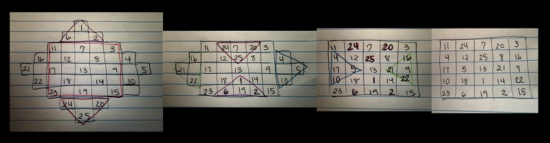

title: "Don't be a Square." What about Math Squares?
author: Alyssa Cruz
date: 2026-05-01
type: blog
courseNumber: MAT4170
term: S26
layout: layouts/blog.njk

# "Don't be a square." 
You've heard this phrase before, most commonly used to describe someone as lame or dull. However, I argue that whoever uses this phrase has yet to dive into mathematical squares with intriguing properties that are not lame nor dull. We will be discussing two in this post: Latin squares and magic squares!

# Latin Squares
## What are they? 
Latin Squares are $n \times n$ arrays with $n$ symbols that are arranged in rows and columns with no repeating symbols in each row or column. A common example is a $3 \times 3$ square where we see each element clearly with no repeats per row or column. 

| 1 | 2 | 3 |
|---|---|---|
| 3 | 1 | 2 |
| 2 | 3 | 1 |

However, numbers are not the only symbols allowed in Latin Squares. They actually received the name "Latin squares" after Leonhard Euler utilized Latin characters (a.k.a. letters) and it became a popular convention. 

So a more conventional example would be the following:

| A | D | C | E | B |
|---|---|---|---|---|
| B | E | D | A | C |
| C | A | E | B | D |
| D | B | A | C | E |
| E | C | B | D | A |

Euler continued his study of Latin squares developing Graeco-Latin Squares that would also called "Euler squares" Others had studied them before Euler but they were just called a pair of "orthogonal squares". 
Graeco Latin Squares are $n \times n$ squares with 2 sets $S_1$ and $S_2$ both with $n$ symbols organized with one element from $S_1$ and one element from $S_2$ in each row and column. The trick is that each ordered pair must be unique.  Jacques Ozanam, a French mathematician, proposed the problem to use  playing cards to create a $4 \times 4$ grid with Latin square properties in both the face card values and the suits of the cards. Below is two of many solutions to this puzzle.

*Solution using Cardcaptor Sakura Collector Playing Cards*

*Solution using Sailor Moon Playing Cards with additional diagonal constraint*

The first published work about Latin squares was not written Euler but instead by korean mathematician Choi Seok-jeong almost seven decades before Euler. Choi shared the first example of a $9 \times 9$ using Chinese numerals in the *Koo-Soo-Ryak*, most similar to a common puzzle with Latin squares.  

## Where do they appear?
The most common appearance of Latin squares are in Sudoku puzzles! The rules are simple: Given a $9 \times 9$ grid, your job is to fill each row, column, and  $3 \times 3$ sub grids with numbers 1-9 exactly once per section. With some time and some critical thinking one can find a solution that meets these requirements for sudoku puzzles of varying difficulties.
|  1 |  2 |  3 | \| |  4 |  5 |  6 | \| |  7 |  8 |  9 |
|:--:|:--:|:--:|:--:|:--:|:--:|:--:|:--:|:--:|:--:|:--:|
|  4 |  5 |  6 | \| |  7 |  8 |  9 | \| |  1 |  2 |  3 |
|  7 |  8 |  9 | \| |  1 |  2 |  3 | \| |  4 |  6 |  5 |
| -- | -- | -- |  + | -- | -- | -- |  + | -- | -- | -- |
|  2 |  1 |  4 | \| |  3 |  7 |  5 | \| |  8 |  9 |  6 |
|  3 |  6 |  7 | \| |  2 |  9 |  8 | \| |  5 |  1 |  4 |
|  5 |  9 |  8 | \| |  6 |  1 |  4 | \| |  2 |  3 |  7 |
| -- | -- | -- |  + | -- | -- | -- |  + | -- | -- | -- |
|  6 |  3 |  1 | \| |  5 |  4 |  2 | \| |  9 |  7 |  8 |
|  8 |  4 |  2 | \| |  9 |  3 |  7 | \| |  6 |  5 |  1 |
|  9 |  7 |  5 | \| |  8 |  6 |  1 | \| |  3 |  4 |  2 |

If given a blank $9 \times 9$ grid, there are actually over $10^{10}$ ways to create a Latin square of order 9 according to Stanley E. Bammel & Jerome Rothstein in Vol. 11 of the *Discrete Mathematics* journal in 1975. 

Another appearance is more for those studying mathematics in group theory. We saw Latin squares within our Cayley tables.

|        |    | $e$    | $r$    | $r^2$  | $r^3$  | $f$    | $rf$   | $r^2f$ | $r^3f$ |
|--------|----|--------|--------|--------|--------|--------|--------|--------|--------|
|        |    | ----   | ----   | ----   | ----   | ----   | ----   | ----   | ----   |
| $e$    | \| | $e$    | $r$    | $r^2$  | $r^3$  | $f$    | $rf$   | $r^2f$ | $r^3f$ |
| $r$    | \| | $r$    | $r^2$  | $r^3$  | $e$    | $rf$   | $r^2f$ | $r^3f$ | $f$    |
| $r^2$  | \| | $r^2$  | $r^3$  | $e$    | $r$    | $r^2f$ | $r^3f$ | $f$    | $rf$   |
| $r^3$  | \| | $r^3$  | $e$    | $r$    | $r^2$  | $r^3f$ | $f$    | $rf$   | $r^2f$ |
| $f$    | \| | $f$    | $r^3f$ | $r^2f$ | $rf$   | $e$    | $r$    | $r^2$  | $r^3$  |
| $rf$   | \| | $rf$   | $f$    | $r^3f$ | $r^2f$ | $r$    | $r^2$  | $r^3$  | $e$    |
| $r^2f$ | \| | $r^2f$ | $rf$   | $f$    | $r^3f$ | $r^2$  | $r^3$  | $e$    | $r$    |
| $r^3f$ | \| | $r^3f$ | $r^2f$ | $rf$   | $f$    | $r^3$  | $e$    | $r$    | $r^2$  |
# Magic Squares
Now lets take a look at a related square called "magic squares."
## What are they? 
A magic square is an $n \times n$ square filled with a set of numbers where each row, column, and diagonal sums to the same number called a magic constant. One example would be a magic square with increasing distinct values of $S = \\{1, 2, ..., n, n+1, ..., n^2 \\}$, similar to a $3 \times 3$ subgrid of a Sudoku puzzle. These are called classical or normal magic squares.
One interesting fact of normal magic squares is that all magic squares the same order n have the same magic constant. 
The magic constant $M$ can be found using the following equation: $M =\frac{1}{2}n(n^2 +1)$ \
So all magic squares of order 3 have a magic constant $M = \frac{1}{2}(3)((3)^2 +1)= \frac{1}{2}(3)(10)= (3)(5)=15$.
There are a few different types outside of normal magic squares. Specifically depending on order, if $n$ is odd, then a magic square is also odd. Even values have two classifications. If $n$ is a multiple of 4, then it is doubly even. I've been calling it a "super even" magic square. A magic square with order $n$ not a multiple of 4 but still even, it gets called an oddly even or singly even magic square. 

## How are they made?
There are a few special method to construct magic squares, but we discuss the simplest one to be brief.

We can construct a normal magic square of order $n = 2k+1$ where $k$ is some integer using the "Siamese method", aslso known as the De la Loubère method after the french mathematician and diplot for Thailand (formerly known as Siam). 

* Since $n$ is odd we will place 1 in the top row center column. We want to place the digits diagonally up to the right from this starting point until can't maneuver. 
* We move up one row and move over one space to the right. Since 1 is in the top row, we will loop to the bottom row to place 2. 
* We keep placing values in this diagonal manner looping to the left column of the square or to the bottom row until we run into a filled box. 
* Our next number will be placed directly below our most recently place number. In other words, we ignore the diagonal direction (up one row, right one column) and move down one row instead. Now we should be in an space with a blank diagonal. 
* We continue again in this manner (up one row, right one column, then move down one row) until we reach n^2. 

For example, I've created a normal magic square of order 3 below:

Another way to construct odd magic squares, one can utilize the Bachet method created by Claude-Gaspar Bachet de Méziriac shown below for a normal magic square of order 5. 

