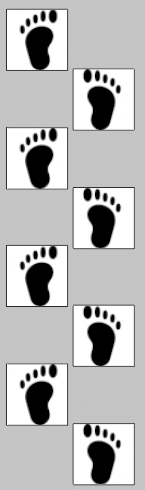
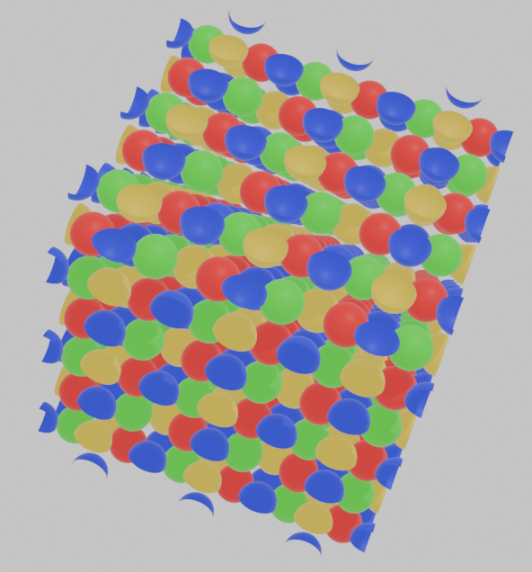
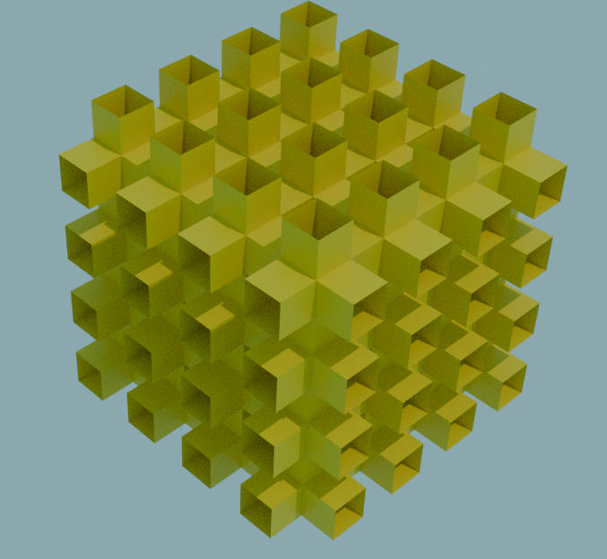
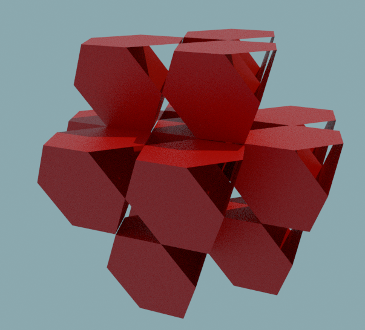

# Leading up to space groups

In abstract algebra we often find ourselves describing groups as symmetries of a physical object. Usually these objects are finite and discrete, meaning they have a finite number of symmetries. This is not the only type of symmetrical object however, there are infinite discrete objects that have infinite symmetries. Some objects like this include friezes, wallpapers, columns, and lattices. 

Lets first look at the simplest example, a frieze. Friezes exist in 2 dimensions, one finite and the other repeating infinitely. Frieze symmetries have a relatively small 7 types up to isomorphism. 

If we were to allow both dimensions to repeat infinitely, we get objects with wallpaper symmetry. These can get more complicated, having 17 different types up to isomorphism.

Looking into into the third dimension, with two dimensions finite and one infinite, there are column symmetries. There are 20 discrete column symmetry groups.

The last option for our purposes (There are many more symmetry groups) are objects which repeat infinitely in 3 dimensions, called space groups. There are a staggering 219 space groups, 35 of which are prime, a distinction to be explained later on in the post.

# Looking at different symmetry types

When it comes to spherical symmetries, repeating any symmetry enough times will eventually lead you back to where you started. This means that all elements of a spherical symmetry group have finite order. In frieze groups and beyond, however, there are symmetries that will never lead you back to where you started. Frieze groups and wallpaper groups have two types of infinite order symmetry, translational and glide symmetry, or a symmetry that includes a mirroring and translation. Whenever an object has a glide symmetry it also has a translational symmetry, but translational symmetries can exist on their own.

These footprints have glide symmetry, because you can shift the pattern to the right and mirror it along the middle and it will look the same as when it started.

Column and space groups gain a new type of symmetry along with glide and translation. These objects can have screw symmetry, or symmetries that require a rotation and translation. Again if an object has screw symmetry, it also has translational symmetry.

# Composite vs Prime space groups

Looking at these objects which are acted upon by certain space groups, you might notice something. A cross section along a certain direction reveals a pattern with wallpaper symmetry; in fact, all cross sections parallel to that plane have that same wallpaper symmetry. It turns out that the object on the left's symmetry group looks like the direct product of a wallpaper group with the $\mathbb{Z}$. Additionally, an infinitely repeating 3d object with glide or screw symmetry also has a symmetry group that looks like the direct product of a wallpaper group and some other group. For this reason, groups like this are called "composite" space groups. 

The object above is acted upon by a prime space group. No family of parallel lines is always preserved when acted upon by elements in the group, and so its symmetries can not be described as the product of a wallpaper group with another group. 

# Point groups and Local Groups of space groups

Spherical groups are sometimes also called point groups because all symmetries of point groups fix one point. Every space group has a corresponding point group that you get when you mod out the translational symmetries of the object. In crystallography, space groups are identified by their corresponding point groups in groupings called crystal systems. Composite space groups can take on a number of point groups while prime space groups have point groups which are always a subgroup of $B_3$. Crystallographers therefore call the prime space groups "cubic". 

There are also point group subgroups of every space group called local groups which are subgroups that fix a single point. Space groups have infinite local groups but finite local groups up to isomorphism. Local groups can be more visually intuitive as they are perhaps the first subgroup you would notice if you were physically manipulating an infinitely repeating object.

# Some interesting objects that space groups act on

The objects above may not look like it, but they are actually relatives to the platonic solids. They are regular polyhedra if you do not require that the object be finite or convex. The object on the left is the multiplied cube, or mucube, and the object on the right is the multiplied tetrahedron or mutetrahedron. It might not come as a surprise then that the local group of the object on the left is $B_3$ or the symmetries of the cube, and the local group on the object to the right is $A_3$ or the symmetry group of the tetrahedron. The mucube has a screw symmetry shifting an "inside corridor" to an "outside corridor" as well as a glide symmetry along the diagonal of one of the axes of the channel.

Note that $A_3$ is a subgroup of $B_3$, the mutetrahedrons symmetry group is also a subgroup of the mucubes symmetry group. While point group subgroup relationships do not always correlate with space group subgroup relationships, all prime space groups are subgroups of the symmetry group for the mucube.

# Conclusion

Space groups are a generalization of the concept of wallpaper groups, but also a generalization of the concept of point, frieze and column groups. Space groups always have 3 linearly independent infinite order translational symmetries. The majority of space groups are extensions of wallpaper groups, while some are unable to be represented as a product of a wallpaper group. The point group and local groups of a space group help us to understand its symmetries in terms of finite objects. The point groups of the prime space groups are all subgroups of $B_3$, while the composite space groups can take on many other point groups. The biggest application of space groups is in crystallography, while there are more esoteric purposes in math, for example to describe some members of the extended family of regular polyhedra.

# References 

1 Golubitsky, M., & Melbourne, I. (2001). A Symmetry Classification of Columns. 

2 Conway, J. H., Burgiel, H., & Goodman-Strauss, C. (2016). The symmetries of things. A K Peters/CRC Press. 
