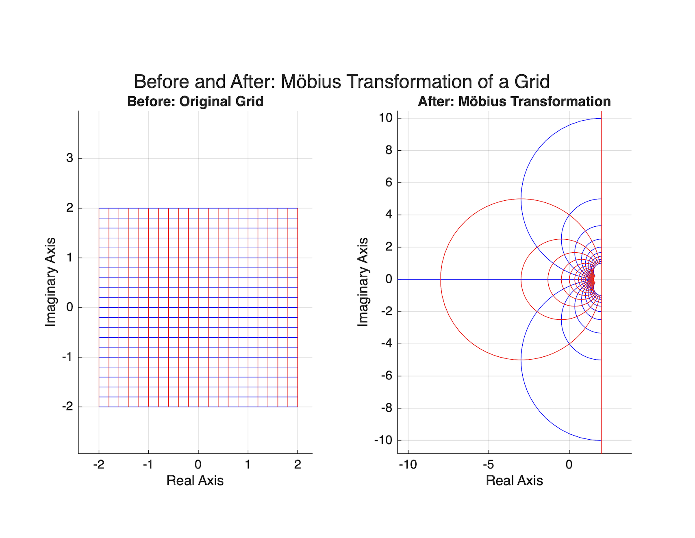

Interestingly enough, Möbius transformations are one of those topics in mathematics that at first glance seem purely algebraic, however the deeper one studies them the more geometry, symmetry, and abstract algebra begin to overlap. In a sense, Möbius transformations allow mathematicians to bend and distort the complex plane while still preserving important geometric structure. Straight lines suddenly become circles, infinity behaves like a legitimate point in space, and despite all this distortion, angles remain preserved. The mathematics behind this topic is not only elegant but surprisingly visual.

A Möbius transformation is a function of the form

$$
f(z)=\frac{az+b}{cz+d},
$$

where

$$
a,b,c,d\in\mathbb{C}
$$

and

$$
ad-bc\neq0.
$$

Keep in mind this condition

$$
ad-bc\neq0
$$

is extremely important because it guarantees the transformation is invertible. Without this condition the denominator could collapse the transformation into something degenerate and unusable. Möbius transformations act on what is known as the extended complex plane,

$$
\mathbb{C}\cup\{\infty\},
$$

meaning infinity itself is treated as a point. At first this sounds strange, however it becomes natural once the geometry is visualized.

What makes Möbius transformations so important is the fact that they are conformal maps. In short, conformal means angle preserving. Interestingly enough, although the global geometry may appear completely warped, locally the structure still behaves the same way. In a sense, it is like stretching and bending a rubber sheet without tearing it. Apart from preserving angles, Möbius transformations map circles and lines to circles and lines. This property becomes visually obvious once a grid transformation is graphed.

---

# Visualizing Möbius Transformations

To better understand this visually, imagine a standard rectangular grid in the complex plane. Before the transformation, every horizontal and vertical line is perfectly straight. After applying a Möbius transformation, the grid bends smoothly and many of those straight lines become curved arcs. Despite this distortion, the angles where the lines intersect remain preserved. That is the remarkable part of the geometry.

The following demonstrates this idea through a before and after visualization:

The left image represents the original grid while the right image shows the transformed grid after applying

$$
f(z)=\frac{z+1}{0.5z+1}.
$$

Now, apart from the geometry itself, Möbius transformations become even more interesting algebraically. When two Möbius transformations are composed together, the result is another Möbius transformation. This property is known as closure.

Let

$$
f(z)=\frac{az+b}{cz+d}
$$

and

$$
g(z)=\frac{ez+f}{gz+h}.
$$

When these are composed together, the resulting coefficients follow the exact same pattern as matrix multiplication:

$$
\begin{pmatrix}
a & b\\
c & d
\end{pmatrix}
\begin{pmatrix}
e & f\\
g & h
\end{pmatrix}.
$$

This is not a coincidence. Every Möbius transformation naturally corresponds to a $2\times2$ complex matrix. Interestingly enough, what initially appears to be a complicated rational function is actually deeply connected to linear algebra.

---

# Möbius Transformations Form a Group

Möbius transformations also form a group under composition. Keep in mind a group requires closure, an identity element, and inverses.

Closure holds because composing two Möbius transformations produces another Möbius transformation.

The identity transformation is simply

$$
f(z)=z.
$$

Every Möbius transformation also has an inverse:

$$
f^{-1}(z)=\frac{dz-b}{-cz+a}.
$$

Again, this inverse exists because

$$
ad-bc\neq0.
$$

Now, here is where things begin to overlap algebraically. Different matrices can actually define the exact same Möbius transformation. Geometrically nothing changes, however algebraically the matrices appear different.

For any nonzero scalar \(\lambda\),

$$
\frac{\lambda az+\lambda b}{\lambda cz+\lambda d}
=
\frac{az+b}{cz+d}.
$$

For example,

$$
\frac{z+1}{z+2}
=
\frac{2z+2}{2z+4}.
$$

At first this may not seem important, however this creates redundancy. One Möbius transformation can have infinitely many matrix representations. Keep in mind mathematicians care about structure and behavior, not duplicate information.

---

# Quotient Groups and Normal Subgroups

This naturally leads into quotient groups. A quotient group essentially groups objects together when they should be treated as equivalent. In this setting, matrices differing only by scalar multiples are treated as the same object.

We begin with

$$
GL(2,\mathbb{C}),
$$

the General Linear Group of invertible \(2\times2\) complex matrices. From there, scalar multiples are identified together.

Interestingly enough, this quotient construction removes algebraic redundancy while preserving the actual geometry of the transformation itself. Ultimately this leads to

$$
PSL(2,\mathbb{C}),
$$

known as the Projective Special Linear Group.

At first normal subgroups may seem like another abstract algebra definition to memorize, however they are actually the mechanism that allows quotient groups to function correctly. Without normality, the quotient construction would fail algebraically.

In this case the subgroup

$$
N=\{\lambda I:\lambda\neq0\}
$$

forms a normal subgroup because scalar matrices commute with every matrix:

$$
A(\lambda I)A^{-1}=\lambda I.
$$

In a sense, scalar matrices are “invisible scaling factors.” They change the matrix representation algebraically without changing the geometric transformation itself.

---

# Isomorphism and the Final Structure

Finally, the most important conclusion of this entire topic is the isomorphism between Möbius transformations and

$$
PSL(2,\mathbb{C}).
$$

An isomorphism means two groups may look different externally, however internally they behave exactly the same way.

We define a map

$$
\Phi:G\to PSL(2,\mathbb{C}),
$$

which sends each Möbius transformation to its matrix equivalence class.

This map works because composition of Möbius transformations corresponds perfectly to matrix multiplication. The map is injective because scalar multiples define the same transformation, and it is surjective because every equivalence class corresponds to some Möbius transformation.

Ultimately,

$$
G\cong PSL(2,\mathbb{C}).
$$

Möbius transformations begin as geometric distortions of the complex plane, however they eventually reveal a deep algebraic structure connecting geometry, matrices, quotient groups, and symmetry. Interestingly enough, what starts as a rational function ultimately becomes one of the clearest examples of geometry and algebra describing the exact same mathematical object from completely different perspectives.
