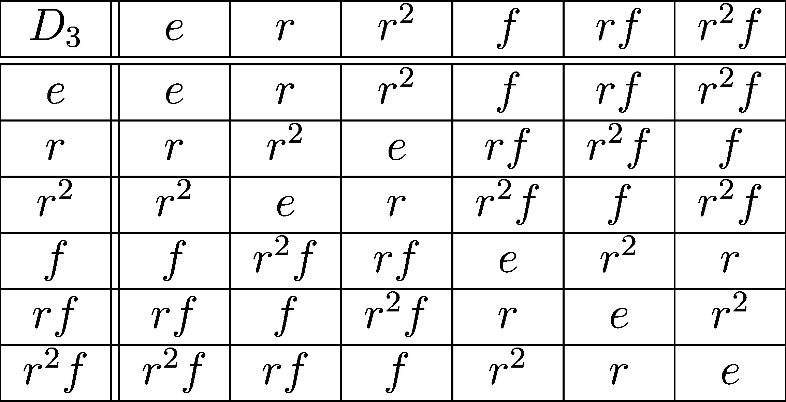

___

Often when we try to motivate group theory, we start off with questions on the symmetries of simple shapes. For example, if we take a regular triangle what are all of the ways we can rotate or flip the triangle such that it looks the same after our action. We learn that these sorts of operations can be understood as the dihedral group $D_3 = \langle r,f | r^3=(rf)^2 = f^2 = e \rangle$ with the element $r$ representing a $60^\circ$ rotation counter-clockwise, $f$ a vertical flip, and $e$ doing nothing.

We learn that it is the algebra (the way these elements can be "multiplied together") that determines the group and the intuitive idea of groups as the symmetries of a shape isn't included in the formal definition of a group. Formally, $D_3$ is a set with 6 elements along with a "binary operation" that follows the Cayley table,

However, our intuition of $D_3$ as a set of symmetries isn't wrong. There must be some way to formalize our geometrical notion of groups.

___

## Group Representations

Let $G$ be a group and $V$ be a finite dimensional vector space. 
>A **representation** of $G$ over $V$ is a group action $\cdot : G \times V \to V$ such that for all group elements $g\in G$, the action satisfies, 
>$$
>g\cdot (ax+y) = a(g\cdot x) + g\cdot y
>$$
>where $x,y\in V$ and $a$ is a scalar.

In other words, for each group element $g\in G$, we get a linear operator on $V$ via the group action! Therefore, for each $g$ we can write its group action on an arbitrary vector as $g \cdot x = T_g (x)$, where $T$ is a linear operator. Now $g$ must have an inverse element $g^{-1}$, and due to the compatibility requirement of the group action, we get that
$$
(g^{-1}*g)\cdot x = g^{-1} \cdot (T_g(x)) = T_{g^{-1}}(T_g(x)) = e\cdot x = I x
$$
Where $I$ is the identity map over $V$. Since this relationship is true for all vectors $x\in V$, we must have that $T_{g_{-1}}(T_g) = I \iff T_{g_{-1}} = (T_g)^{-1}$. Therefore each of the linear operators we get are invertible. (The invertible linear operators over $V$ is called the **general linear group of $V$** and is denoted $GL(V)$.) 

Moreover, our method of assigning group elements to invertible linear operators follows all the rules of a group homomorphism. This gives us another way to define a group representation!

>A **representation** of a group $G$ over a vector space $V$ is as a group homomorphism $\rho : G \to GL(V)$ 

The essence of representation theory is to take our abstract notion of groups and to translate them into a set of linear operators which we know more about and admit tools from linear algebra. Specifically, we will stick to finite dimensional representations (i.e. $\mathrm{dim}(V)<\infty$) this allows us to set $V=\mathbb{R}^{n}$ or $V=\mathbb{C}^{n}$ specifically and all the represented group elements become real valued or complex valued $n\times n$ matrices.

One issue (or benefit depending on your perspective) with group representations, is that there are many choices for the vector space you choose. I can take the group $D_3$ and construct a representation $\rho (D_3)$ which translates $r$'s and $f$'s to $2\times 2$ rotation and reflection matrices ($\rho (D_3) \leq O(2,\mathbb{R})$) or as purely $3\times 3$ rotation matrices ($\rho (D_3) \leq SO(3,\mathbb{R})$). In fact, a lot of interesting results in representation theory concern how representations of the same group differ based on their degree (the dimension of the underlying vector space $\mathrm{dim}(V)$).

## Equivalent Representations

However, even if we choose a fixed degree for our representation, there is still ambiguity on the exact matrices that we end up with. For the $D_3$ example, we can use the degree 3 representation, but the element $f\in D_3$ could be mapped to the matrix
$$
\rho(f) = \begin{pmatrix} -1 & 0 & 0\\ 0 & 1 & 0 \\ 0 & 0 & -1\end{pmatrix}, \text{ or } \rho'(f) = \begin{pmatrix} 1/2 & -\sqrt3/2 & 0\\ -\sqrt3/2 & -1/2 & 0 \\ 0 & 0 & -1\end{pmatrix}.
$$
The first would represent a flip about the top vertex of an equilateral triangle, and the second represents a flip about the bottom right of the triangle. Both choices represent the same thing but they associate different matrices to the group elements. The key is that both of these matrices are similar in the linear algebra sense. There exists an invertible matrix $P$ such that,
$$
\rho(f)=P^{-1}\rho'(f)P.
$$
This holds for the representation of all the elements of $D_3$.
$$
\rho(g)=P^{-1}\rho'(g)P \quad \forall g \in D_3.
$$
> Two representations of a group $G$, $\rho:G\to GL(V)$ and $\rho':G\to GL(V)$ are **equivalent** if $\rho$ and $\rho'$ are similar via the same change of basis matrix $P\in GL(V)$.

For all intents and purposes, equivalent representations are all the same and we are free to move between different equivalent representations depending on which one we find easier to work with.

## Invariant Subrepresentation Decomposition

An interesting, but often under discussed, topic in undergraduate linear algebra is the decomposition of a vector space to invariant subspaces.
Here's the gist. Take a vector space $\mathbb{R}^n$ and a linear operator $T:\mathbb{R}^n \to \mathbb{R}^n$.
In general, $T$ will take all the vectors in $\mathbb{R}^n$ and mix them up. However, there will be some subspaces of $\mathbb{R}^n$ which are mixed into themselves.
Consider the matrix,
$$
R=\begin{pmatrix}0 & -1 & 0 \\ 1 & 0 & 0 \\ 0 & 0 &1\end{pmatrix}.
$$
This matrix rotates vectors in $\mathbb{R}^n$ and rotates them $90^\circ$ about the z-axis. What's important is that all the vector on the xy-plane stay on the xy-plane after the rotation. Additionally, vectors on the z-axis stay on the z-axis (they don't move in-fact). We would call both the xy-plane and the z-axis **invariant subspaces** of $R$ and we can "split up" $\mathbb{R}^n$ into the two invariant components. Specifically, we write $\mathbb{R}^n = U \oplus V$ where $U =\mathrm{span}(\hat x,\hat y)$ and $V = \mathrm{span}(\hat z)$.

If we take a closer look at $R$, we see that it is in so-called **block diagonal form**, the top left is a $2\times 2$ sub-matrix and the bottom right is a $1\times 1$ submatrix with the rest of the entries equal to zero. This is no mere coincidence, it is representative of the fact that our basis vectors $\hat x,\hat y, \hat z$ span the two invariant subspaces $U$ and $V$. For a general linear operator over a finite-dimensional vector space, we can break up the space into these invariant subspaces. Then, we find basis vectors for each of the individual subspaces. Finally, we change our basis to the one made up of the bases of the subspaces. In this new basis the matrix representing the linear operator will always be block diagonal with the size of each block determined by the dimension of its corresponding subspace.

For representation theory, we are interested in finding some sort of invariant subspace decomposition that works with all the matrices of the translated group elements. 
> Given a representation $\rho : G \to GL(\mathbb{R}^n)$, a **subrepresentaion** of $G$ is a subspace $U\subseteq \R^n$ such that $\rho(g)(U) \subseteq U$ for all $g\in G$.

In particular, we want to take a representation $\rho$ of a group $G$ with order $|G|=m$ over a vector space $\mathbb{R}^n$, we want to find a decomposition $\mathbb{R}^n = U_1\oplus \dots\oplus U_j$ such that $\rho(g)(U_k) \subseteq U_k$ for all $g\in G$ and $1\leq l \leq j$.

Now, we can go through the process of decomposing a representation into subrepresentations, but what if we can repeat this process and split each of the subrepresentations into smaller ones. Clearly, we can't break down a 1 dimensional representation any further (if we ignore 0 dimensional subspaces), but does it hold that all subrepresentations can be broken down into 1 dimesional parts?
> A representation is said to be **reducible** if it has a subrepresentation which is non-zero and not itself (a vector space is always a subspace of itself). If no such subrepresentation exists, the representation is **irreducible**.

The answer is no! In fact the interesting bits of representation theory are about breaking representations down into their irreducible parts.

## A Reason To Care About Trace

Trying to find irreducible subrepresentations is not an easy experience in general. Luckily for us, we can shortcut this process with an often under-appreciated concept from linear algebra, the trace.

When we make a representation, we get one matrix for every element of the group we're representing. If we take the trace of all these matrices, we get a number (real or complex) for each group element. This defines a function from the group to numbers which we call the character.
> The **character** of a representation $\rho:G\to GL(\mathbb{R}^n)$ is a function $\chi:G\to \mathbb{F}$ ($\mathbb{F}=\mathbb{R}/\mathbb{C}$) defined by
>$$\chi(g) = \mathrm{tr}(\rho(g))$$
>for all $g \in G$.

Surprisingly, the character tells almost everything we need to know about our representations. Because the character is a function over a finite domain, it lives in a vector space of functions. In particular, we can define a special kind of inner-product on this vectors space as follows.

Let $\mathcal{F}(G)= \{f|f:G\to \mathbb{F}\}$ denote the set of functions on $G$ define an inner product on this as,
$$
\langle f_1,f_2 \rangle = \frac{1}{|G|}\sum_{g\in G} \overline{ f_1(g)}f_2(g).
$$
> Given a group $G$. If $\chi$ and $\chi'$ are the characters of two representations of $G$, the following results hold.
> 1. If $\chi = \chi'$, then the representations are equivalent.
> 2. If $\chi$ and $\chi'$ come from irreducible and non-equivalent representations, then
> $$\langle\chi,\chi' \rangle = 0.$$
> 3. If $\chi$ is irreducible then $\langle \chi, \chi \rangle = 1.$

Miraculously, the non-equivalent characters of irreducible representations are orthonormal according to this new inner product. If we want to know if a representation is reducible or not, we just need to compute its "length" via $\langle \chi,\chi\rangle$. If it has unit length, it's irreducible. If not, it's reducible. 

Character theory goes far deeper than this and it's utility and convenience is immediately apparent after trying to find subrepresentaions without it.

