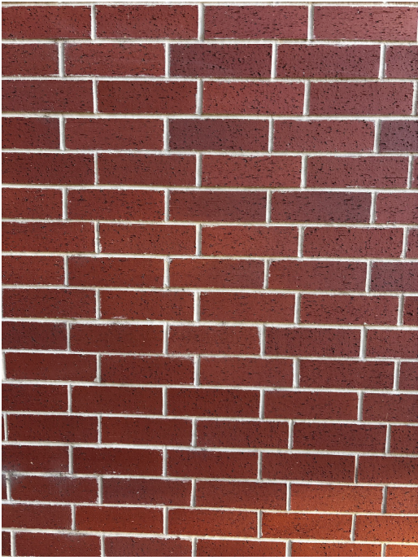
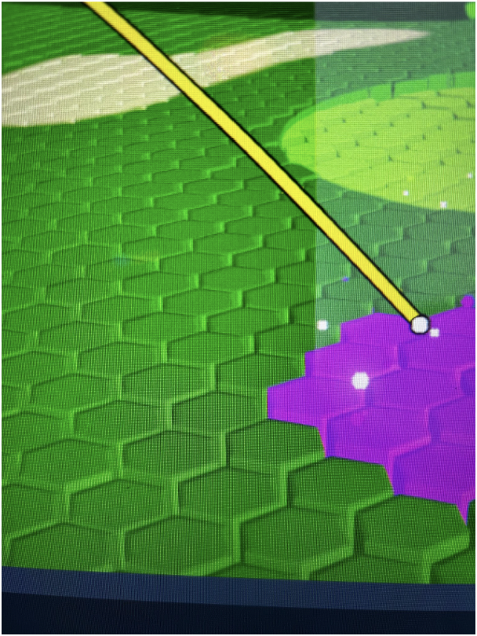
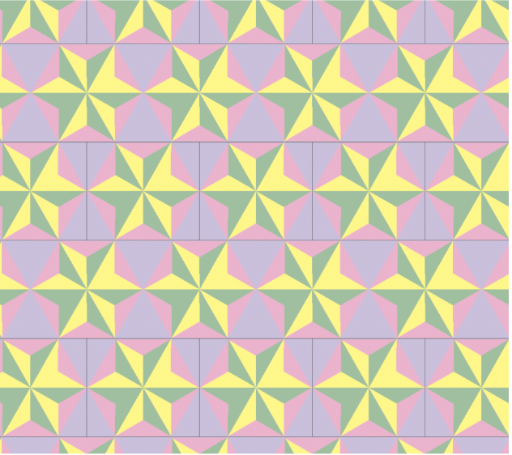

## Patterns

Patterns are everywhere, you can see them in tile floors, brick walls, fabrics, and even in nature. Once you start paying attention, you begin to notice the same shapes repeating over and over again in different directions.

But how do these patterns actually work? What kinds of movements can you make without changing how they look? Some patterns can be shifted, rotated, or reflected and still appear exactly the same, which shows that there is something deeper going on.

## What Even Counts as a Symmetry?

Before getting into wallpaper groups, it’s important to understand what symmetry actually means. In simple terms, a symmetry is a way you can move a pattern and it still looks exactly the same. There are a few main types of symmetries.

One is translation, which is when you slide a pattern in a certain direction. Another is rotation, where you turn the pattern around a point. There’s also reflection, where you flip the pattern across a line, and glide reflection, which is a combination of reflecting and then translating along the line.

Even the way these movements combine is consistent, since grouping them in different ways still gives the same result. Because of this, the symmetries of a pattern form a structured system of transformations rather than just a random collection of movements.

What’s interesting is that you don’t have to look at these movements one at a time—you can actually combine them. If you apply one symmetry and then another, the result is still something that leaves the pattern unchanged. There’s also a “do nothing” movement that keeps the pattern exactly the same, and every movement can be undone by reversing it. Because of this, these symmetries don’t just exist on their own—they fit together in a consistent way.

## Translations

To make this more concrete, we can start naming these movements more precisely. Let \(T_1\) be a translation that moves a pattern one unit to the right, and let \(T_2\) move it one unit up. If we apply \(T_1\) and then \(T_2\), we get another symmetry, which we can write as \(T_1 T_2\). We can keep combining these, so something like \(T_1^2 T_2^3\) just means moving right twice and up three times. No matter how we combine these translations, we always stay within the set of symmetries.

One example of this shows up in something as simple as a brick wall. In this pattern, the main symmetries come from translations. If we let \(T_1\) represent shifting the pattern one brick to the right and \(T_2\) represent shifting it one row up, then any symmetry of the wall can be written as a combination of these, like \(T_1^a T_2^b\) for integers \(a\) and \(b\). This means we can move the pattern any number of steps horizontally and vertically and it will still line up perfectly with itself. What’s interesting is that there are no rotations or reflections that preserve the entire pattern, so the symmetry group here is made entirely of translations. Because combining two translations gives another translation, and every translation can be undone, these symmetries satisfy the properties of a group. The identity is just not moving the pattern at all, and the combination of translations is associative, so all of the group properties hold in this example.

## Dihedral System

So far, these symmetries have mostly been translations, but some patterns have more structure than that. For example, in patterns like hexagons or certain tiles, you can rotate the pattern around a point and it still looks the same. If we let \(r\) represent a rotation and \(f\) represent a reflection, we can describe these symmetries more precisely. In some cases, doing a rotation multiple times brings you back to where you started, like \(r^6 = e\) for a hexagon. Reflections also undo themselves, so \(f^2 = e\). What’s interesting is that combining these doesn’t behave randomly—in fact, they follow patterns like \(fr = r^{-1}f\), which is something we’ve seen before when working with dihedral groups like \(D_n\). So some of the symmetries in these repeating patterns actually behave just like the groups we’ve studied.

A more complex example appears in patterns made of hexagons. In this case, the symmetries are not just translations. There are also rotations and reflections. If we let \(r\) represent a rotation around the center of a hexagon, then rotating the pattern by \(60^\circ\) maps it onto itself, and doing this six times brings it back to where it started, so \(r^6 = e\). If \(f\) represents a reflection across a line of symmetry, then applying it twice returns the pattern to its original position, so \(f^2 = e\). These symmetries follow consistent rules, such as \(fr = r^{-1}f\), showing that these symmetries follow a consistent set of rules. This makes the overall symmetry much richer than patterns that only involve translations. These symmetries also form a group because combining rotations and reflections always produces another symmetry of the pattern. There is an identity transformation, every symmetry has an inverse, and the way these transformations combine is associative. This shows that even more complex patterns still satisfy the same group structure.

## So What Is a Wallpaper Group?

So this is where everything starts to come together. If you take all of the symmetries of one of these repeating patterns, translations, rotations, and reflections all of it and group them together, you get what’s called a wallpaper group. Basically, it’s the full collection of every possible way you can move the pattern in two linearly independent ways and have it still look exactly the same. And here’s the really cool part even though there are infinitely many patterns you could draw, the types of symmetry they can have are actually limited. There are only 17 possible wallpaper groups. That means every repeating pattern in the plane, no matter how detailed or complicated it looks, fits into one of just 17 categories.

I created this pattern using a repeating design made in Illustrator. The pattern repeats in two directions, so it has translation symmetry since it can be shifted horizontally and vertically and still line up with itself. It also has rotational symmetry. If you look at the points where the shapes meet, rotating the pattern around those points maps it onto itself. Because these movements can be combined and still produce symmetries of the pattern, they form a group.

## Wait… Why Only 17?

At this point, it kind of feels like there should be way more than 17, right? Like if you can mix translations, rotations, reflections, and glide reflections in so many different ways, why is the number so small? The reason is that not every combination actually works in a repeating pattern. For example, only certain rotations fit together nicely with translations, like \(60^\circ\), \(90^\circ\), \(120^\circ\), and \(180^\circ\). If you try something like a \(45^\circ\) rotation, it won’t line up in a way that lets the pattern repeat across the plane. Because of these kinds of restrictions, a lot of possible symmetry combinations end up not being possible at all. When this was worked out, it was found that everything collapses down to just 17 distinct types. So even though the patterns themselves can look completely different, the underlying symmetry structure is always one of those 17.

## You Can’t Unsee This Now

When you first look at patterns in the real world, they just seem like decoration something you don’t really think too much about. But once you start paying attention to how they repeat and what kinds of movements leave them unchanged, there’s actually a lot going on underneath. What looks like a simple tile floor or a brick wall ends up having a whole system of structure behind it, where every symmetry fits into a larger collection of transformations.

The coolest part is that all of this complexity still follows a set of rules. Even though patterns can look completely different from each other, their symmetries always fall into one of just 17 types. So something that seems purely visual turns out to have a really organized mathematical structure behind it. Once you see that, it’s kind of hard to look at patterns the same way again.
