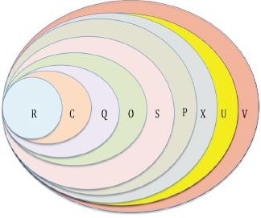
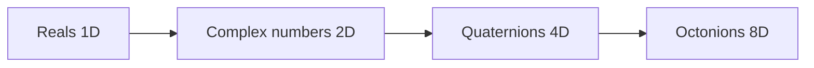

*We are gonna look into gimbal lock, Euler angles, and why quaternions feel like magic.(spoiler its because they are)*

---

## An palace of the mind example

Imagine a dice rolling in free space.

You want to turn it:

- left and right
- up and down
- and roll it like a barrel

One common way to describe that motion is with **Euler angles**, breaking it down to:

- yaw
- pitch
- roll

[^1]: {ye, baseball, barrel} is the complementary set

The trouble is that Euler angles describe rotation as **three turns in a row**.

When two of those turning directions line up, one direction disappears.

That is **gimbal lock**, which you should be able to test out via the interactive.

<model-viewer
  src="dodecahedron_gimbal_lock.glb"
  alt="Gimbal lock example"
  camera-controls
  auto-rotate
  style="width: 100%; height: 400px;">
</model-viewer>

---

## Why gimbal lock can be frustrating

Imagine an roating object is sitting inside three spinning rings.

- one ring turns it left-right
- one ring turns it up-down
- one ring rolls it around

Normally, each ring gives you a different kind of motion.

But if the middle ring turns to a special angle, two rings point the same way.
Then two controls start doing almost the same job.
You have not broken the object, but you **lost a clean independent direction**.

That is why animators, roboticists, graphics programmers, **and I** dislike gimbal lock.

---

## The highlevel math perspective *Since this is a math blog afterall

The set of 3D rotations is called $SO(3)$. And the Kjy understanding is: 

> 3D rotations do not behave like ordinary addition on a flat grid.

If you rotate around $x$ and then around $y$, you do **not** get the same answer as rotating around $y$ and then around $x$.

In summary, rotation order matters.

That is why rotation is hard.

---

## Euler angles are a recipe, not the rotation itself

Euler angles give a rotation by saying:

1. turn around one axis
2. then another axis
3. then another axis

A recipe can work well, but it can also have bad coordinates.

Gimbal lock is a **coordinate singularity**: the rotation still exists, but your chosen coordinate recipe stops behaving nicely.

---

## Quaternions use a different idea

A quaternion looks like this:

$$
q = a + bi + cj + dk
$$

The important idea is that instead of breaking up a rotation into pitch yaw and roll,

> a unit quaternion stores one whole rotation at once.

Instead of saying:

- first do this turn, (pitch)
- then this turn,     (yaw)
- then this turn,     (roll)

it says:

- here is the axis,
- and here is the amount.

That is the foundational idea as to why quaternions help to avoid gimbal lock

<model-viewer
  src="dodecahedron_quaternion_axis_angle.glb"
  alt="Quaternion rotation example to prove that I'm right'"
  camera-controls
  auto-rotate
  style="width: 100%; height: 400px;">
</model-viewer>

---

## Why quaternions avoid gimbal lock

Unit quaternions live on a sphere in four dimensions, usually written as $S^3$.

You do not need to picture four-dimensional space perfectly.
The useful idea is only this:

- Euler angles try to navigate rotation space with stacked angle coordinates
- quaternions represent the rotation as one point on a smooth sphere-like object

So there is no moment where two control rings collapse into each other.

That is why quaternions do not suffer from gimbal lock the way Euler-angle coordinates do.

---

## The action rule

To rotate a vector $v$, we convert it into a pure quaternion and apply:

$$
v' = qvq^{-1}
$$

This is called the **sandwich product**.

Why is it so useful?

- it keeps lengths the same
- it keeps the motion as a true 3D rotation
- it composes rotations smoothly

If $q$ is built from a unit axis $\mathbf{u}$ and angle $\theta$, then:

$$
q = \cos\left(\frac{\theta}{2}\right) + \mathbf{u}\sin\left(\frac{\theta}{2}\right)
$$

That half-angle is not a typo. It is part of why quaternions form a double cover of $SO(3)$.

---

## Why $q$ and $-q$ mean the same rotation

For unit quaternions,

$$
qvq^{-1} = (-q)v(-q)^{-1}
$$

So two opposite points on the quaternion sphere represent the same physical 3D rotation.

That is why people say unit quaternions form a **double cover** of $SO(3)$.

You can think of it like this:

- quaternion space keeps a little more information than plain rotation space
- that extra room helps make the coordinates smooth

---

## A tiny Cayley-Dickson section (Because I really like the idea, sue me)

Quaternions can also be viewed as part of a bigger ladder of number systems:
Specifically Its a Cayley-Dickson deconstruction of the Reals.

This is the defintion:

Given an algebra $A$, we form a new algebra of pairs $(a, b)$ with multiplication:
  $ (a, b)(c, d) = (a c - d^* b, d a + b c^*) $

A useful simplification for why this is cool is:

- each order of deconstruction gives you an additional dimention to mess with in the same world of numbers. 
- but each step also loses a nice algebra rule

So you get literally extra dimentions of perspectives to play with the same feild of numbers. If you have ever had to work with complex numbers, you can easily understand why thats useful *sometimes. 

For example:

- the reals are ordered and commutative
- the complex numbers stay commutative but are no longer ordered the same way
- the quaternions lose commutativity
- the octonions lose associativity (this is wild to me)

So quaternions sit in a goldilocks zone.
They are rich enough to model 3D rotation beautifully, but still rigid enough to be practical unlike Septernions.

*for legal purposes the title was a joke*
---

## Connecting with reality
*just in case you were waiting for the spoiler, math is magic thus so are quaternions by induction, 
QED.*

I hope this post has shed light on the advantages of using quaternions, which is because they are good tool to do the following tasks:

- stable orientation tracking
- smooth interpolation between orientations
- compact storage
- safe repeated composition of rotations

This is why they show up in:

- games
- cameras
- drones
- spacecraft
- robot arms
- *smart alec placeholder

*smart alec placeholder (TM), covers all ideas that you want to add here that I did not mention*
---

## Try the demos *I hope they still work, else please use your ~Imagination~. 
