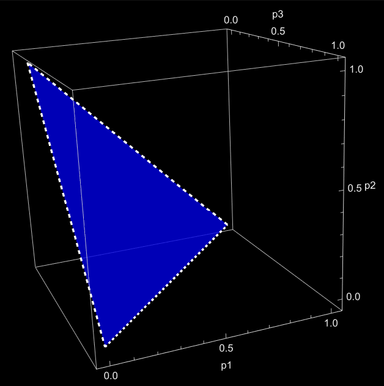

## Motivation

What does it mean for probabilities to "live in a space"?

If we take all possible probability distributions on k+1 outcomes, we get a geometric object called the k-simplex.

---

## The k-Simplex

The k-simplex is defined as

$$
\Delta^k = \{ (x_0, \dots, x_k) \in \mathbb{R}^{k+1} \mid x_i \ge 0,\ \sum_{i=0}^k x_i = 1 \}.
$$

This is a subset of $\mathbb{R}^{k+1}$, but it is actually k-dimensional.

---

## The Probability Simplex

We can interpret $\Delta^k$ as the space of all probability distributions on k+1 outcomes.

- Each coordinate represents a probability  
- The sum-to-one condition constrains the space  
- Non-negativity restricts us to a bounded region  

This makes the simplex a natural object in:

- probability theory  
- statistics  
- information geometry  

---

## The Case k = 2

When k = 2, the simplex consists of triples $(x, y, z)$ such that

$x + y + z = 1, \quad x, y, z \ge 0$.

This forms a triangle in $\mathbb{R}^3$.

### Visualization

*Figure: The 2-simplex representing all probability distributions on three outcomes.*

---

## Geometric Insight

Although the simplex sits in $\mathbb{R}^{k+1}$, it is actually a k-dimensional manifold (with boundary).

For example:

- $\Delta^1$ is a line segment  
- $\Delta^2$ is a triangle  
- $\Delta^3$ is a tetrahedron  

---

### Why This Matters

From a differential geometry perspective, $\Delta^k$ is a manifold with boundary embedded in $\mathbb{R}^{k+1}$. The interior, where all $x_i > 0$, is a smooth $k$-dimensional manifold, while the boundary corresponds to distributions where one or more probabilities vanish.

This matters because many tools from differential geometry apply directly:

- We can define tangent spaces at interior points as vectors whose coordinates sum to zero   
- Paths in the simplex correspond to continuous changes in probability distributions  

The equation $\sum_{i=0}^k x_i = 1$ cuts out a surface, and the inequalities keep us inside a bounded region.

So instead of thinking of probability distributions as abstract lists of numbers, we can think of them as points moving around in a geometric space.

---

### Tangent Spaces

At a point $p \in \Delta^k$, the tangent space consists of vectors $v$ such that $\sum_{i=0}^k v_i = 0$.

This reflects the idea that any movement inside the simplex must preserve total probability.

---
### Boundary Geometry

Each face is itself a simplex:

- Setting $x_i = 0$ gives a $(k-1)$-simplex  
- These faces intersect along lower-dimensional simplices  

So the simplex is a nice example of a geometric object built out of pieces of different dimensions.

---

## The Hypervolume of the Simplex

One of the nicest geometric facts about the simplex is that we can compute its volume both as a subset of $\mathbb{R}^{k+1}$ and as its "flattened out" version in $\mathbb{R}^k$

At first glance, this is a little confusing. The simplex $\Delta^k$ lives inside $\mathbb{R}^{k+1}$, but it is only k-dimensional.

---

### Flattening the Simplex

To compute this volume, we rewrite the simplex in terms of independent coordinates.

Starting with $\Delta^k = \{(x_0,\dots,x_k) \mid x_i \ge 0,\ \sum_{i=0}^k x_i = 1\}$,
we solve for one variable:
$x_0 = 1 - \sum_{i=1}^k x_i$.

This gives a parametrization:
$\phi(x_1,\dots,x_k) = \left(1 - \sum_{i=1}^k x_i,\ x_1,\dots,x_k\right)$,

with domain
$x_i \ge 0, \quad \sum_{i=1}^k x_i \le 1$.

Geometrically, this “flattens” the simplex onto a region in $\mathbb{R}^k$.

---

### The Differential Geometry View

Now we compute volume the same way we would for a surface: using the induced metric.

The tangent vectors are
$\frac{\partial \phi}{\partial x_i} = (-1, 0, \dots, 1, \dots, 0)$,
where the 1 appears in the $i$-th coordinate.

Taking dot products gives the matrix of the first fundamental form:
$g_{ij} = \left\langle \frac{\partial \phi}{\partial x_i}, \frac{\partial \phi}{\partial x_j} \right\rangle$.

A quick computation shows:
- $g_{ii} = 2$  
- $g_{ij} = 1$ for $i \ne j$

So the metric matrix is

This matrix has a special structure, and its determinant turns out to be
$\det(g) = k+1$,
a constant in terms of the dimensionality.

So the volume element is

$\sqrt{\det(g)} = \sqrt{k+1}$.

---

### Integrating the Volume

We now integrate over the region
$\{x_i \ge 0,\ \sum x_i \le 1\}$.

A standard result from multivariable calculus is that

$\int_{\sum x_i \le 1, x_i \ge 0} 1 \, dx_1 \cdots dx_k = \frac{1}{k!}$.

Putting everything together,

$\text{Vol}(\Delta^k)= \int \sqrt{\det(g)} \, dx =
\sqrt{k+1} \cdot \frac{1}{k!}$.

---

### The Extrinsic Volume

You might have seen the formula

$\mathrm{Vol} = \frac{1}{k!}$
before. This refers to a slightly different viewpoint.

- The region $\{x_i \ge 0,\ \sum x_i \le 1\} \subset \mathbb{R}^k$ has volume $\frac{1}{k!}$  
- The actual simplex sitting inside $\mathbb{R}^{k+1}$ has volume $\frac{\sqrt{k+1}}{k!}$

The difference comes from geometry: the simplex is “tilted” inside $\mathbb{R}^{k+1}$, and the factor $\sqrt{\det(g)}$ corrects for that distortion.

---

## Conclusion

The k-simplex gives a geometric home to probability distributions.

Instead of viewing probabilities as just numbers, we can think of them as points in a structured geometric space. 

In the end, the simplex is not just a combinatorial object, it is a concrete example of how geometry, calculus, and linear algebra all come together.
