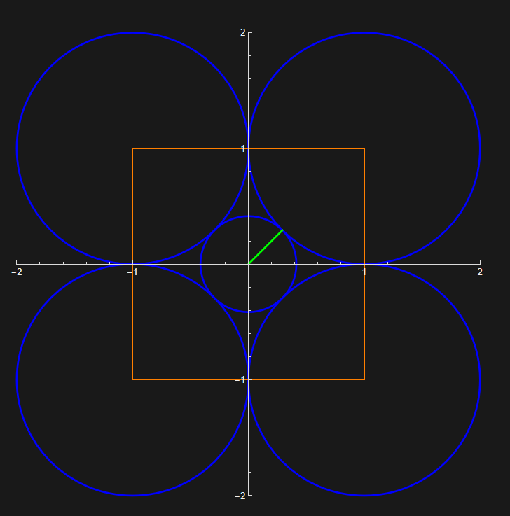
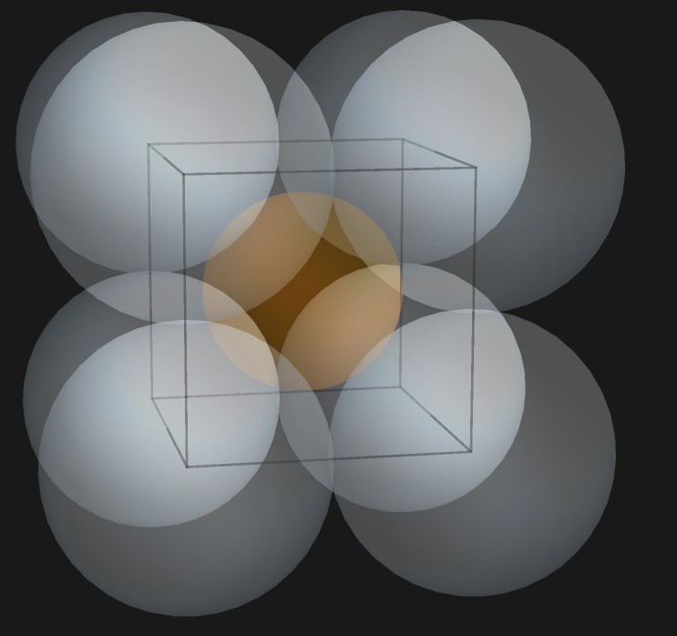

Have you ever wondered how higher dimensional shapes behave? For example, how the volume of an $n$-dimensional ball changes as a $n$ increases or how a $n$-cube’s corners take up most of the volume or how they stretch in a sense and become spikey. I did not originally think about volume or how the volume of a cube concentrates at the corners, but I have wondered how different shapes behave generally in higher dimensions. But I never thought to explore until this project. 

## n-ball volume
What if I told you that as the dimensions increase, most of the volume of an $n$-dimensional ball is concentrated towards the boundary sounds weird. Let me try to explain. The volume of a $n$-dimensional ball of radius $1$ is $V_n = \frac{\pi^{n/2}}{\Gamma\left(\frac{n}{2} + 1\right)}$, we get $V_1= 2, V_2= \pi, V_3= \frac{4}{3} \pi, V_4= \frac{\pi^2}{2}, V_5= \frac{8\pi^2}{15}, V_6= \frac{\pi^3}{6}.....V_5 > V_6$. After dimension 5, 5 being the peak for this example the volume begins to collapse. If the volume is less than $1$ but greater than $0$ it collapses to $0$ faster this is because the Gamma function grows at a faster rate and since it is in the denominator, the fraction goes to 0 faster. Even in cases where the radius is greater than $1$ it still collapses to $0$ just a little slower. Weird right. What is happening is the volume in a sense, is being pushed outward. If you go higher like dimension 100 the volume is basically the outer shell of whatever a 100-dimensional ball looks like. Think of random coordinates in a unit sphere such as $0.2^2+0.3^2+0.4^2 = 0.29 \le 1$ which is in the sphere, $d=\sqrt{.29}$ roughly $0.538$ so about half way to the boundary. Now consider a unit 100-dimensional ball with all coordinates $0.1$ so $100 \cdot (0.1)^2 =1$ which is at the boundary of our unit 100d ball where $d=\sqrt{1}=1$ so in high dimensions coordinates must be extremely tiny to stay inside, to be exact coordinates must shrink at $\frac{1}{\sqrt{n}}$ to be within a 100-dimensional ball yet their distances still end near 1 i.e. volume concentrates towards the boundary. The interior essentially contributes nothing to the volume.

## n-cubes
Now what about cubes?
Let's start with a unit square with four unit circles at the corners and a center circle tangent to the four corner circles like this, (see figure 1). We get that the center's circle’s radius is $\sqrt{2}-1$. Now imagine this same set up in 3 dimensions. A Cube with eight spheres at the corners and a center sphere tangent to all others (see figure 2) we get its radius to be $\sqrt{3}-1$, in $R^4$ its $\sqrt{4}-1$ . Now if we increase dimensions then we get, for the smallest $n$-dimensional ball we can fit in the center using this same set up has radius $\sqrt{n}-1$. The corners of the cube grow at a rate of $\sqrt{n}$ because the distance from the center to a corner is $\sqrt{n}$ while the side length stays the same. This is where the idea of the cube becoming spikey and the corners get farther away as we move up in dimensions. Just as the $n$‑ball pushes volume outward, the $n$‑cube pushes volume toward its corners.

### Figure 1.

### Figure 2.

## Behavior in higher dimensions
What do hypercubes and hyperspheres look like?
To get an idea lets think about the corners of a square. A 1‑dimensional hypercube is just a line segment with 2 vertices and 1 edge. A 2‑dimensional hypercube is a square with 4 vertices and 4 edges, in 3 dimensions it's just a cube 8 vertices and 12 edges. So as we increase dimensions we get vertices that grow at $2^n$ where each corner’s distance from the center is $\sqrt{n}$. As $n$ increases the corners grow exponentially and the corners get farther away from the center. The corners are spikey in the sense that corners dominate the geometry. And if you take two random vectors they are more than likely always orthogonal where the size of their dot product is typically $\sqrt{n}$ and each vectors magnitudes are each about $\sqrt{n}$, so the product is about $n$. For example, let's say we have 2 random vectors in $R^4$ let  $$\mathbf{v} = \begin{pmatrix} 1 , -1 , 2 , 0.5 \end{pmatrix}$$ and  $$\mathbf{u} = \begin{pmatrix} -2 , 1 , 0.5 , -1 \end{pmatrix}$$. Taking their dot product, $\mathbf{v} \cdot  \mathbf{u}$ and dividing by the product of their magnitudes $ || \mathbf{v}||$ $|| \mathbf{u} ||$ we get $\frac{-2.5}{6.25}=-0.4$. Like we did in class this gives us the cosine of the angle which is $cos(\theta)=|\frac{\mathbf{v} \cdot  \mathbf{u}}{|| \mathbf{v}|| || \mathbf{u} ||}|$ where if this value is 0 then the vectors are orthogonal. Our numerator is  $|-2.5|$ is approximately the size of $\sqrt{4}$ and the denominator is $2.5 \cdot 2.5$ which is approximately $\sqrt{n} \cdot \sqrt{n} =n$ . Increasing dimensions yields that for any 2 random vectors $cos(\theta) \approx \frac{1}{\sqrt{n}}$ which trends to $0$ giving us the result of almost always orthogonal vectors.  As well as hypercubes, hyperspheres behave weirdly in higher dimensions. So a circle can be decomposed into infinitely many line segments by slicing. While a sphere is something similar, a stack of circles obtained by slicing along one coordinate and a 4-dimensional hypersphere is a stack of lower dimensional spheres. They maintain smoothness i.e. no edges or vertices and they are perfectly symmetric in all directions. Essentially an $n$ ball is composed of a stack of $(n-1)$ dimensional balls in a geometric sense not literal.
