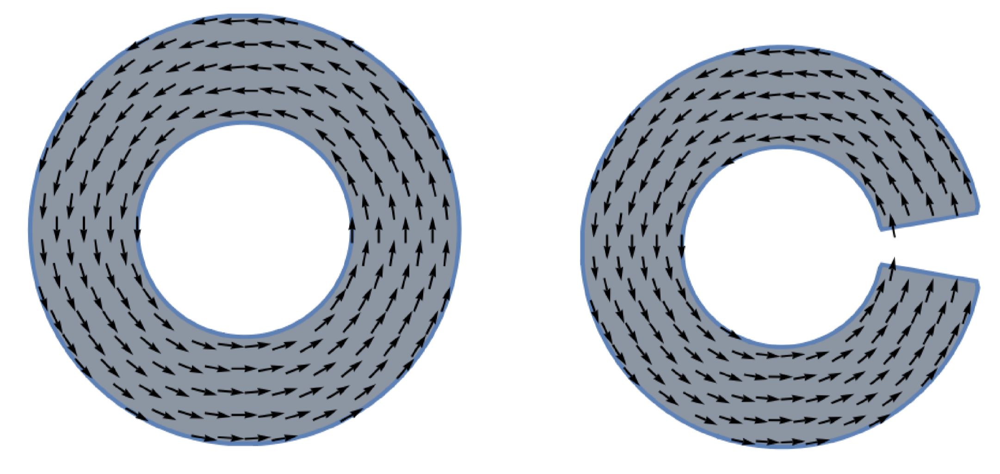
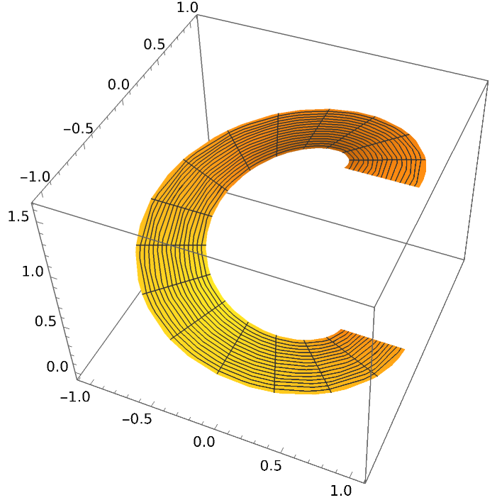
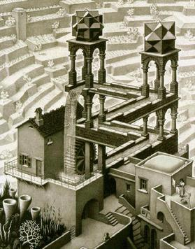
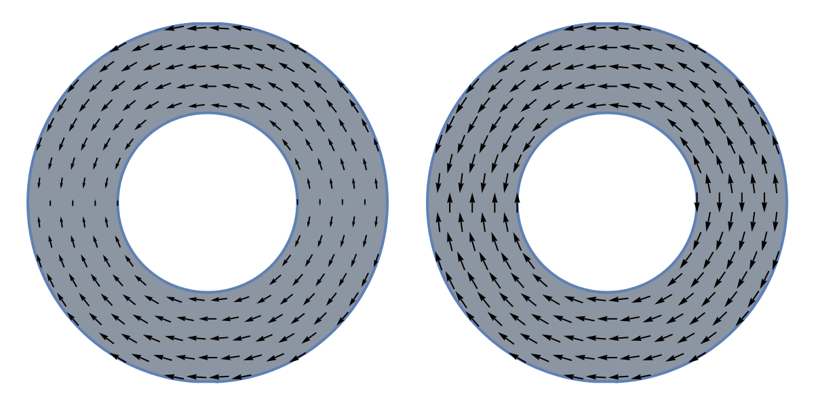

## Introduction

One of the most fundamental properties of a shape is its number of holes. Mathematicians have come up with a variety of tools to detect the presence of different kinds of holes. One of these tools is called _cohomology_, and the topic of this post is one kind of cohomology: de Rham cohomology, named after the Swiss mathematician Georges de Rham.

I'll start by talking about “first-order” de Rham cohomology, which detects the kind of hole seen in the left-hand figure but not the right-hand one:

<figure>
  
  <figcaption>
   <b>(Figure 1)</b>
  </figcaption>
</figure>

The main idea is to find ways in which a substance like water can _flow_ through the shape that are impossible under gravity alone. Consider the following flows, represented by vector fields:

<figure>
   
  <figcaption>
   <b>(Figure 2)</b>
  </figcaption>
</figure>

Producing the flow on the right gravitationally is physically possible. For example, you could make a waterslide like this:

<figure>
  
  <figcaption>
    <b>(Figure 3)</b>
  </figcaption>
</figure>

But water flowing around a _closed_ canal under gravity alone lies in the realm of Escher:

<figure>
  
</figure>

So the impossibility of a perpetually cycling waterway has something to do with the hole that distinguishes a figure O from a figure C.

## Part 1: First de Rham cohomology
### 1.1. Broad strokes

So far, we have a very loose idea of what we want to do: detect holes in a surface by looking for impossible flows. In this section, we’ll figure out how to make the concept of a “flow impossible under gravity” more formal.

Like in the introduction, we’ll think of flows as _vector fields_, which assign an arrow to each point of the surface. And we want these vector fields to be “smooth”—in math language, that means they should have continuous derivatives of every order. In the following figure, the vector field on the left is smooth, while the one on the right is not (note how the vectors point into each other on the left of the right ring and point away from each other on the right; this isn’t a problem on the left ring because they smoothly shrink to 0 before switching directions):

<figure>
  
</figure>

And to formalize the idea of a “landscape” on which the fluid flows under the influence of gravity, we’ll use a *scalar function*, which can be thought of as an elevation map. We’ll graph these like color-coded topographic maps. In the below figure, the function attains its highest value at 2 o’clock and smoothly drops as we move counterclockwise to its lowest value at 4 o’clock.

<figure>
  
</figure>

One of the most important ideas behind first-order de Rham cohomology is that there’s a correspondence between landscapes and flows. For a landscape, imagine rolling a ball or spilling water at every point and recording in which direction and how quickly it moves. Those data points can always be turned into a smooth vector field. For the C-shape above, the resulting vector field would look something like the right-hand one in Figure 2.

We can also try to go in the other direction. Imagine looking at a vector field that records where things flow at each point on a landscape and trying to reconstruct the landscape. If you were doing this physically, one strategy would be to start by placing a panel of some kind at an angle to produce the desired flow at a given point, then placing more panels adjacent to it and repeating the process until the whole surface has been built. But this is not always possible! Imagine trying to build a landscape to produce the left-hand flow in Figure 2. No matter where you started, if you used the panel-by-panel method, you would end up making a staircase like Figure 3 that can’t be closed up into the desired shape because there’s an unavoidable elevation gap.

In math language, of course, the correspondence between local flows and global landscapes is simply the derivative–integral correspondence given by the fundamental theorem of calculus. Specifically, we can turn a scalar function to a vector field using the gradient operator, and we can try to turn a vector field into a scalar function by integrating. The latter operation isn’t given as much in-depth coverage as other topics in vector calculus, but you’ll probably recall having learned it at some point when you see the following example.

Let’s work out a simple example symbolically. The vector field on the left of Figure 2 can be expressed as $f(x,y) = (-y, x)$. Trying to build a landscape with that flow is equivalent to trying to solve the equation
$$\\nabla f(x,y) = (-y,x),$$
or, equivalently, the system of equations

$$\\frac{\\partial f}{\\partial x}(x,y) = - y, \\quad \\frac{\\partial f}{\\partial y}(x,y) = x.$$

Integrating with respect to the appropriate variables, we get

$$f(x,y)=-x y + C(y), \\quad f(x,y) = x y + C(x).$$

It’s not too hard to see that there doesn’t exist a function whose only $x$-dependent component is $-x y$ and whose only $y$-dependent component is $xy$; hence, building the landscape is impossible.

### 1.2. Working out some kinks

We now have a pretty rough idea of how to detect holes. We can at least say one thing: if there exists a flow that doesn’t correspond to a landscape, the surface has a hole; if every flow has a landscape, there are no holes. But if we add a bit of extra cleverness, we can detect *how many* holes the surface has, not just whether there is at least one.

Here’s the problem: Even if a surface has only one hole, it will have infinitely many impossible flows—so we can’t just count impossible flows to determine how many holes there are. ((todo: explain why infinite)) Whatever we do has to detect some internal structure in the infinite set of impossible flows that distinguishes between there being one hole and there being two. We’ll do this by making precise what it means for 2 flows to “detect the same thing”.

We want this concept to have 2 properties:
(a) Every flow that has a landscape detects the same thing—nothing.
(b) If flow $X$ and flow $Y$ detect the same thing, then for any $Z$, flow $X + Z$ and flow $Y + Z$ (where $+$ indicates vector addition at each point) also detect the same thing.

Property (a) is hopefully intuitive. Property (b) is more difficult to motivate, and I won’t get deep into it here, but hopefully it isn’t actively counterintuitive. Luckily, there turns out to be one and only one relation which respects both properties (formally, this is a result in the theory of *quotient groups*). That relation is: flows $X$ and $Y$ detect the same thing if and only if their difference $X - Y$ has a landscape.

It takes a bit of work to show this, but if we treat flows that detect the same thing as the same object, what we end up with can (usually) be neatly factored into a few families of impossible flows that detect specific features of our shape. I won’t go through any of the computations here, but I’ll show a few examples so you can get a feel for what kinds of things the flows say about the shape.

### 1.3. Examples

1. The de Rham cohomology of a space without any holes is trivial—i.e., all flows are equivalent to $0$.
2. The de Rham cohomology of a ring is the 1-dimensional space of real numbers $\\mathbb R$.
3. In general, the dimension of the cohomology space usually corresponds to the number of holes in the shape. For example, the space shown below has a cohomology of $\\mathbb R^3$, the 3d space of triples of real numbers:

<figure>
  
</figure>

## Part 2: Second de Rham cohomology

### 2.1. Motivation

First de Rham cohomology can detect particular kinds of holes, like the hole in a donut. But it can’t distinguish between a solid ball and a hollow sphere. It turns out that “hollowness” is a _higher-dimensional kind of hole_ that we need a higher-dimensional theory to detect. Luckily, there are versions of de Rham cohomology in $n$ dimensions that can detect $n$-dimensional generalized holes. Here, I’ll briefly cover second de Rham cohomology in 2d.

### 2.2. Exterior derivative

The most important property of the derivative is that it’s *dual* to the integral by the fundamental theorem of calculus. This is important for de Rham cohomology theory, even though we haven’t explicitly encountered it yet. In a sense, counting the flows that don’t have a landscape is kind of like counting ways in which a generalized version of the FTOC fails when applied to our space. So to step up to higher dimensions, we want a “higher-order” analogue of the derivative which obeys a version of the FTOC.

On a 2d surface, what we’re working with locally looks like a vector field that can be written as

$$F(x,y) e_1 + G(x,y) e_2,$$

where $e_1$ and $e_2$ are the 2 basis vectors in our local coordinate system. So we essentially have 4 derivatives to work with: $\\partial F/\\partial x$, $\\partial F/\\partial y$, $\\partial G/\\partial x$, and $\\partial G/\\partial y$.

The naive solution would be to shove all 4 derivatives into a matrix. This is commonly called the _total derivative_ (as opposed to the “partial” derivative) and is useful in some places, but here it has a fatal flaw: it doesn’t obey a sufficiently nice version of the FTOC. (Actually, the (matrix) integral of the total derivative in a region _does_ only depend on the value of the vector field along the boundary, but in a significantly more awkward way; this is very interesting but beyond the scope of this blog post.)

It’s difficult to motivate exactly why, but the best thing to do here is to “antisymmetrize” the total derivative—to force onto it a particular kind of symmetry that fixes the awkwardness and makes the FTOC work in the contexts we want. Using $e_{i j}$ to denote the basis matrix with a $1$ at row $i$, column $j$ and zeros everywhere else, we antisymmetrize by identifying $e_{i j}$ with $-e_{j i}$. (Formally, we are passing through the quotient from a tensor power to an exterior power.) Note that this means $e_{i i} = -e_{i i} = 0$.

$$\\begin{pmatrix}
\\frac{\\partial F}{\\partial x} & \\frac{\\partial G}{\\partial x} \\\\
\\frac{\\partial F}{\\partial y} & \\frac{\\partial G}{\\partial y}
\\end{pmatrix}
= \\frac{\\partial F}{\\partial x} e_{1 1} + \\frac{\\partial G}{\\partial x} e_{1 2} + \\frac{\\partial F}{\\partial y} e_{2 1} + \\frac{\\partial G}{\\partial y} e_{2 2}$$
$$= 0 + \\frac{\\partial G}{\\partial x} e_{1 2} - \\frac{\\partial F}{\\partial y}  e_{1 2} + 0. $$
$$= \\left(\\frac{\\partial G}{\\partial x} - \\frac{\\partial F}{\\partial y}\\right) e_{1 2}. $$

You probably recognize that expression as an integrand in Green’s theorem, and that’s exactly what’s going on. In 2d, the second de Rham cohomology detects failures of the 2d FTOC, i.e., Green's theorem. Specifically, the generators—instead of being flows without landscapes—are landscapes without flows, where the derivative taking a flow to a landscape is given by $\\frac{\\partial G}{\\partial x} - \\frac{\\partial F}{\\partial y}$.

This generalizes to higher dimensions as the _exterior derivative_, which essentially is what results from taking the total derivative of a map (which will usually be a higher-rank tensor) and antisymmetrizing in the same way.
