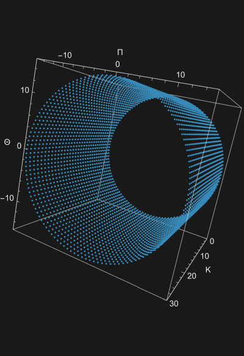
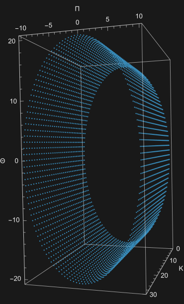
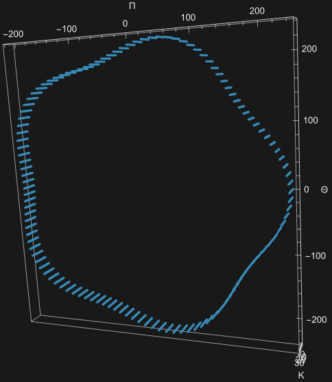
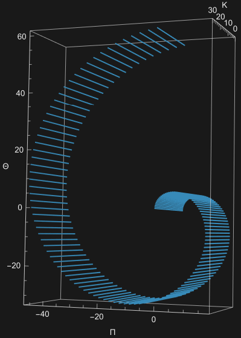
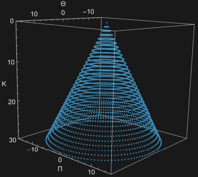
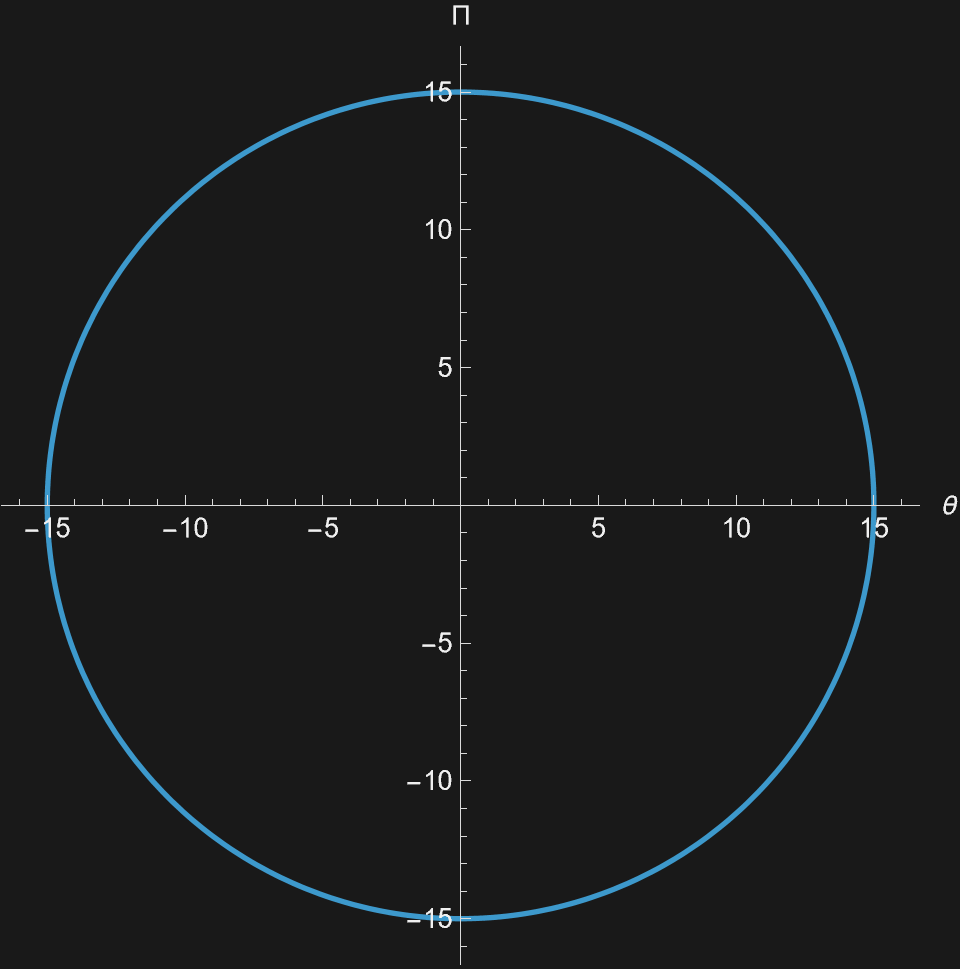
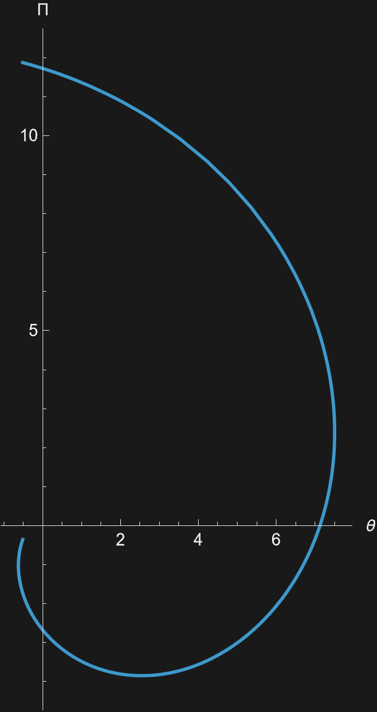
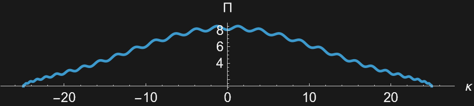
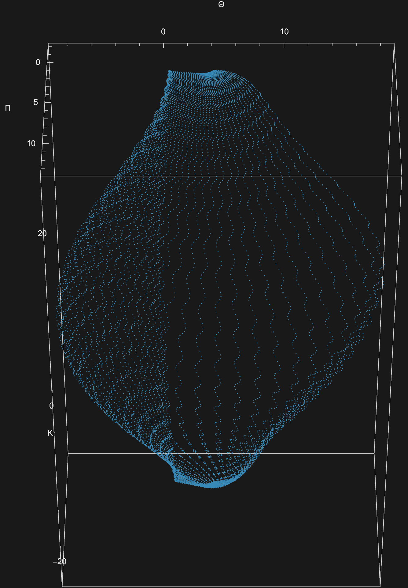
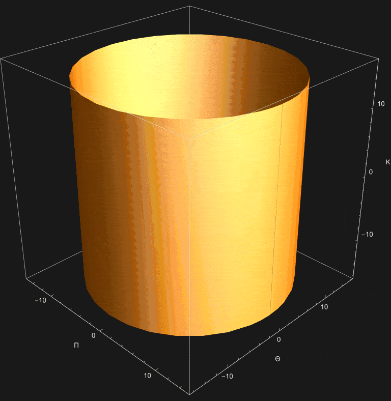

# Pasta Design and Family
## The Basic Pasta Parameters

Each parametric for each pasta is defined in terms of two arbitrary variables, $i$ and $j$. These variables' range varies and may not agree with each other. For example, *Cappelletti* has them ranging from $0$ to $40$ for $i$ and $0$ to $120$ for $j$. It is also important to note that different pastas actually use one or the other set to either $1$ or $0$ when generating their shapes.

What really differentiates the different shapes in their actual parametric equations. They are pretty much self explanitory, the equation denoted $\Pi$ is used for the length of the noodle, $\Theta$ is the width of the noodle, and $K$ is the depth. Each of these equations takes in $i$ and $j$ and outputs the view of the cross-section at that specific point. Many pastas describe these as trig functions $\sin$ and $\cos$ and so they also have a period, 

In the rest of this whole section, we will see how changing the initial $i$ and $j$ inputs for these cross-sections can change our pasta as well as how we can change the phase of the pasta equations change their shapes.

## Pasta in Detail

Each pasta is governed by two inputs, $i$ and $j$. These inputs define out shape by acting as coordinates in a $2\text{D}$ space. The range of these variables tell us where a pasta begins and where it ends when we graph them using the actual parametric equation, especially since we won't neccesarily be using all the values of one variable when constructing certain parts of the pasta. Throughout our reading, we will be manipulating the length, width, and depth equations, these equations take in a pair $(i,j)$ and output a single value. The length and width equation $\Pi$ and $\Theta$ and graphed to form cross-sections and other shapes vital to the pasta. Other more complex pasta shapes involve using the height $K$ to generate complicated shapes. So, when we get a point $(i,j)$ and we plug them into our equations we get a single point for our pasta, and when we run through every possible combination we get our yummy pasta noodle. In a way, $i$ and $j$ are "sliders" for our pasta equations and the actual parametric equations are our coordinates.

## Simple pastas

One can't imagine a pasta more simple than *acini di pepe* which is just a ring. This shape is good for us to understand how the parameters govern it on a simple level. The inputs are $i = 0 \text{ to } 120$ and $j = 0 \text{ to } 30$ and uses $\sin$ and $\cos$ functions to form the ring shape, $\Pi_{i,j}=15\cos\left(\frac{i}{60}\pi\right)$ and $\Theta_{i,j}=15\sin\left(\frac{i}{60}\pi\right)$. 

  

For the actual shape, $i$ is fixed and $j$ is varied to create a circle, then $j$ is changed using $K$ to extruded the shape. To see how these things can affect the shape, lets lower the amplitude of $\Pi$, for visual purposes the amplitude of $\Theta$ will be raised. This gives us an oval shape. If we wanted to make it look like it got ran through the washing machine, mulitplying $\sin$ waves gives us a bobbing look almost like a star. If instead we wanted to vary the radius of our acini, we can either choose to vary it every $j$ or $i$, every $i$ resolves to a spiral and every $j$ leaves acini looking like a cone.

  
  
  
  

To summarize, we can control the pasta shape in a 2D setting by manipulating the inputs to the parametric equations that define the shape. We can also change some conditions of the equations such as radius to get more shapes.

### A Not so simple pasta: *Conchiglie Rigate*

Although messing with a really simple pasta shape like Acini is all good, the sea of pasta shapes a vast one and includes some unique ones as well. I say sea of pasta shapes because this is looks like a sea shell. Conchiglie Rigate is one such pasta that demonstrates the complexity and beauty of parametric shapes in pasta design. While the cross section of Acini is just a constant circle, Conchiglie Rigate has a cross section that changes with $j$.

  
  

The height $K$ is also different, being a $\cos$ function of $j$ instead of being constant.

  

  

  

  

### Pasta Groups

These pasta characteristics, their shape and form, can be used to form groups of pasta from which we can draw conclusions on their function, cooking time, and generally the shapes on pastas we do not know. For example, Acini di pepe is in a family that in Legendre's book is described as straight, solid, smooth-smooth, basically simple spherical pstas and is related to pastas like linguini and spaghetti. If you have these pastas you can see how their cross sections are all simple circles, only differing in size. The next most related famliy to these pastas is one that includes lasagna, mafaldine, and tropoline, which are all also straight and solid but have a more flat cross section with optional ruffles at the ends. It is sort of easy to see how these two groups are related since we can simply take the circle of the first group and flatten it to get the second group, however they are separate groups because of the rufflesm and the difference in size, transitioning from one group to the other is not as simple as changing a parameter, it is more of a change in the actual equations that govern the pasta and so the end shape becomes distorted and not as yummy looking.

  

The gif shown is of acini di pepe being transformed into mafaldine, and as you can see, the final shape is not as good as an actual mafaldine. Additionally, for pastas really distantly related one would have to stretch and distort the shape either by compramising on the final shape or by changing the equations in a way that is not just changing inputs but rather the actual equations. Pasta does not go into itself and actual pasta dough may not be able to stretch small shapes into big ones and vice versa, so the final shape may not be as good as an actual pasta.

## Conclusion

In conclusion, the world of pasta is a vast and often overlooked one, but it one that is just as full of complexity and shape beauty as any other field of design. The parameters that govern the shape of pasta are not just arbitrary numbers, but rather they are the building blocks that create the unique and delicious shapes we all know and love. By understanding these parameters and how they interact with each other, we can gain a deeper appreciation for the art and science of pasta making, and perhaps even inspire us to create our own unique pasta shapes in the future.
