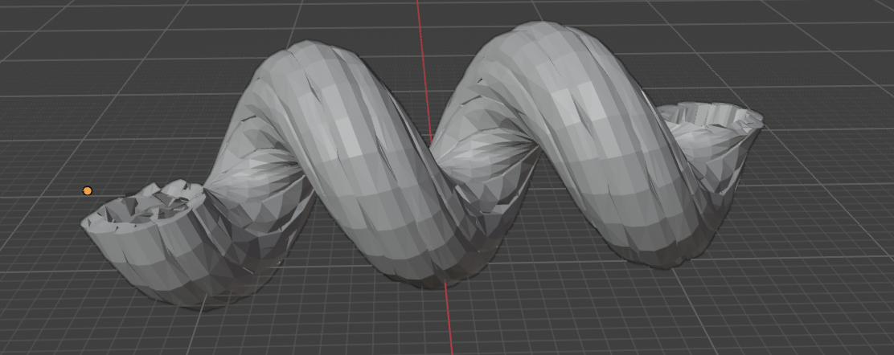
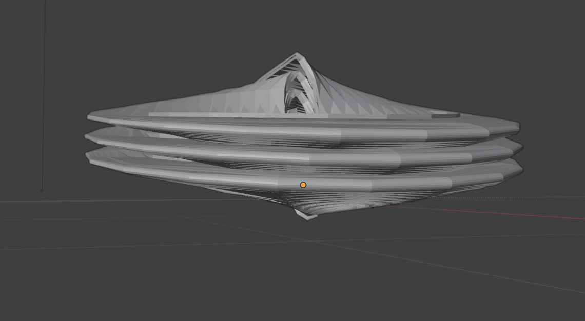
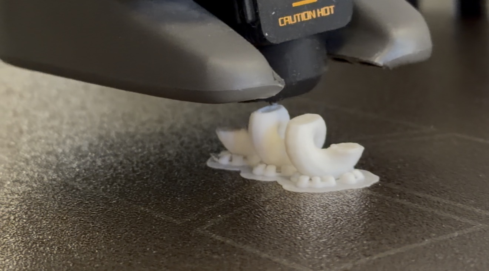

## Introduction
*Pasta by Design* by George L. Legendre is a quirky book that can find its place in the home of a mathematician, pasta lover, or anyone who might be intrigued by the peculiar and wonderful design of pasta. It is an easily digestible book, quickly giving the reader a small summary of the pasta's cultural significance, what ingredients are typical companions with it, cook time, its physical categorical attributes, along with a photo, and most intriguingly for my blog post, the parametric equations that model them. 

I love to eat pasta so much that if I had to eat only one thing, it would be pasta. So it is not enough for me to simply look at the equations; it's rather teasing. Instead, I wanted to find a way to model them appropriately to 3D print them. So, this blog post is all about the path to 3D printing them.

## Background
The easily digestible nature of the book allows the reader to go about enjoying it in any way they want. If your thing is looking at pictures and making your kitchen look cool, then go at it. However, I'll explain how to interpret the nice equations that give the book its meat. Legendre models the pastas in ($\Pi,\ \Theta,\ K$) coordinates, where each of these components is a functions of two variables, $i$ and $j$. Legendre mainly uses trigonometric functions to achieve the complexities of the pastas. No summarization could do these equations justice. I highly recommend taking a look for yourself to see the details I am sure to have missed.

## 3D Modeling & Printing
Printing these pastas is very easy and much less intimidating than it seems. Legendre has done all the hard work, and we are left with a couple of small steps to 3D print these models. I used Mathematica as it can (sometimes) export a .stl file very nicely.

**Step 1:** Choose a pasta you like from the book and copy down the equations, $\Pi(i, j),\ \Theta(i, j),\ K(i, j)$, into Wolfram Mathematica.

**Step 2:** Form a vector-valued function, $\mathbf{r}$, of two variables,

$$
\mathbf{r}(i, j)=\begin{pmatrix}
\Pi(i, j)\\
\Theta(i, j)\\ 
K(i, j)
\end{pmatrix}.
$$

**Step 3:** Form the normal vector $\mathbf{N}$, 

$$\mathbf{N}=\displaystyle \frac{\mathbf{r}_i\times \mathbf{r}_j}{||\mathbf{r}_i\times \mathbf{r}_j||}.$$

**Step 4:** Using $\mathbf{N}$, we can now move each point on the surface by using

$$
\mathbf{r}(i,j) + t \mathbf{r}(i, j),
$$

where $t\in \mathbb{R}$.

**Step 5:** Use ParametricPlot3D to plot 

$$
\mathbf{r}(i,j) + t \mathbf{N},
$$

$$
\mathbf{r}(i,j) - t \mathbf{N}
$$

for the $i$ and $j$ ranges shown in the book. This will nearly give you your finished digital pasta model. Now we just need to close the gap. Also, the gap should be reasonable and can be referenced with the photos in the book.

**Step 6:** Export this digital design into a .stl file.

**Step 7:** You may use Blender or another similar software. I used the "Solidify" modifier in Blender to adjust the thickness to close the gap between the two individual plots. Once you close the gap, you will have your .stl file ready to use for any 3D printer of your liking.

I finished my 3D models of a cavatappo and cappelletto in Blender, as shown below. Note: The plural (and title that you'll find in the book) of cavatappo and cappelletto are cavatappi and cappelletti, respectively.

<table>
  <tr>
    <td align="center">
      
 
      <em>Figure 1: Cavatappo with Thickness in Blender</em>
    </td>
    <td align="center">
      
 
      <em>Figure 2: Cappelletto with Thickness in Blender</em>
    </td>
  </tr>
</table>

I 3D printed a Cavatappi since it was one I knew would come out well in a 3D printer compared to other models. I got this knowledge by reading a book review by Laura Taalman. There, Laura Taalman's students successfully printed a Cavatappi. Due to the lack of time I had to print it, I printed it as small as possible and could not get its hollow structure because of its small size. This could be easily fixed by increasing its size.

 
<em><strong>Figure 3:</strong> 3D Printing a Cavatappi</em>

## Results & Reflection
I am sure that someone with more 3D printing knowledge can take a glance at the pictures in the book and see which pastas are easiest to print and which ones would give the printer some difficulty. I think the simpler structures that do not have so many twists and turns, especially in close proximity to itself, like my model of a cappelletto, would be easier to model and print. Even looking at my cappelletto, it seems that the values for $i$ and $j$ were set too high on the author's part.

I attempted to plot Festonati as described in the book using my method; however, it never finished. This may be a mistake on my part, or perhaps there is a larger issue at play.

With this guide to 3D print the models from *Pasta by Design*, no doubt anyone can spend a fair amount of time making their own models and further understanding the parametric equations by playing around with them in Mathematica.

## Conclusion
If you have ever wondered about the math behind pasta or any food items, then this is a great book to have in your possession. I also think that it is an awfully fun way to keep your mind refreshed with the topics learned in class. There is plenty more to be done than simply 3D modeleling them. They are also a good conversation starter.
