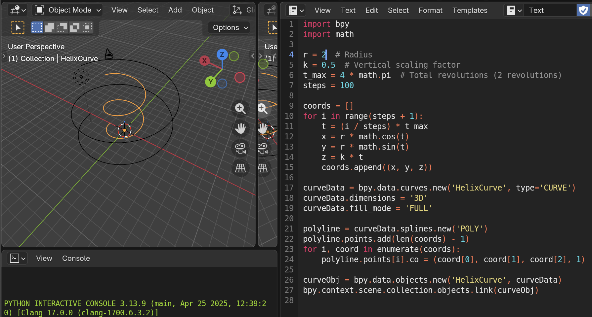
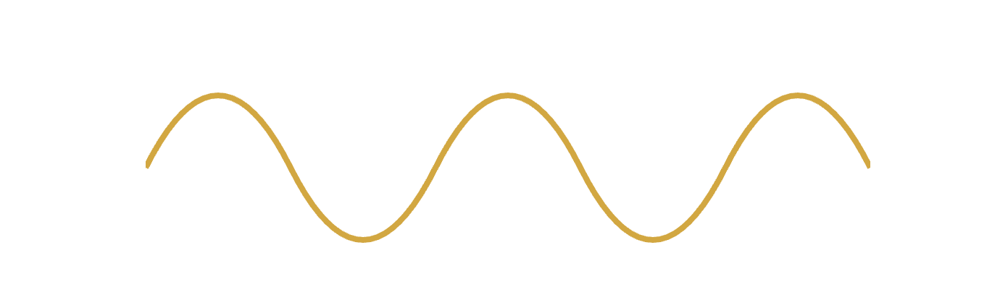
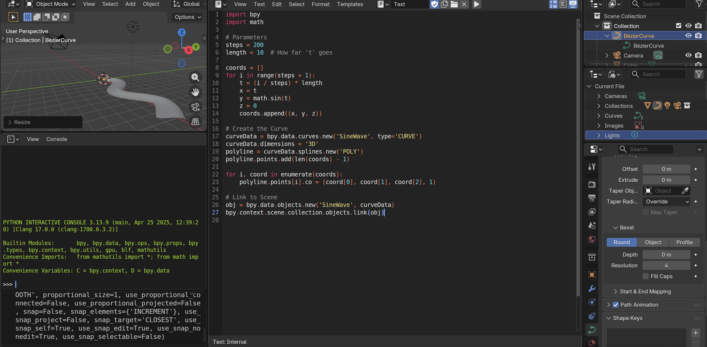
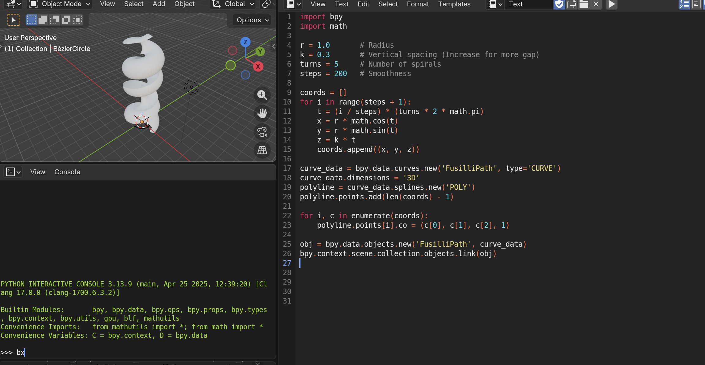

  When I first flipped through *Pasta by Design*, I expected a blend of math and food. What I didn’t expect was how deeply it would pull me into questions about structure, material behavior, and the limits of digital modeling. This project started as an attempt to recreate a few of the pasta geometries from the book, but it quickly turned into something much more experimental. I began designing my own pasta shapes and learning what worked, what failed, and why.

  I started this project by going through *Pasta by Design* by George L. Legendre, and honestly it was different from what I expected. The book does not really treat pasta as food so much as geometric structure. A lot of the designs come down to relatively simple curves that are twisted, stretched, extruded, or repeated through patterns.

  Once I started thinking about pasta as a mathematical object instead of just something edible, the whole project became much more interesting. Shapes that initially looked decorative suddenly became questions of geometry, topology, symmetry, and material behavior. One of the biggest surprises was realizing that mathematically beautiful designs are not always physically possible.

> **Main Question:**  
> How can mathematical geometry create pasta shapes that are visually interesting *and* physically functional?

---

# 1. Recreating Pasta from Mathematical Rules

Legendre’s central idea is that pasta can be described through parametric curves and geometric transformations. Instead of thinking about shapes like *fusilli* or *penne*, you think in terms of:

- A base curve
- A cross-sectional profile
- A geometric transformation

For my first attempt, I recreated a spiral pasta inspired by fusilli.

The parametric equations were:

```math
x = r\cos(t)
```

```math
y = r\sin(t)
```

```math
z = kt
```

Where:

- \(r\) controls the radius of the spiral
- \(k\) controls the vertical spacing

In Blender, I:

- Generated a helix curve
- Created a circular profile
- Used a bevel modifier to wrap the profile around the curve

  

### What Worked

The result visually resembled real spiral pasta very quickly.

### What Failed

The spacing between coils became a major issue. If the turns were too close together, the geometry intersected itself. Even when the model looked fine digitally, it would likely fail physically because real dough would stick together during manufacturing or cooking.

---

> **Lesson Learned:**  
> Mathematical elegance does not guarantee physical viability.

---

# 2. Designing My Own Pasta Shapes

After recreating traditional pasta forms, I started experimenting with original designs.

## Concept: “Wave Ribbon Pasta”

My goal was to create a pasta shape that:

- Held sauce effectively
- Remained structurally stable
- Looked visually dynamic

I began with a sine wave:

```math
x = t
```

```math
y = \sin(t)
```

```math
z = 0
```

Then I extruded a thin ribbon along the curve and introduced twisting proportional to curvature.

---

## 2D Representation

Below is a simplified SVG representation of the waveform:

```html
<svg width="500" height="200" viewBox="0 0 500 200" xmlns="http://www.w3.org/2000/svg">
  <path d="M 0 100 
           Q 50 0, 100 100 
           T 200 100 
           T 300 100 
           T 400 100 
           T 500 100"
        stroke="goldenrod" fill="none" stroke-width="4"/>
</svg>
```



---

## 3D Interpretation

In 3D, the ribbon oscillated side to side, creating pockets intended to trap sauce.



### What Worked

- The alternating curvature created natural sauce pockets
- The ribbon structure would likely dry faster because it used less material

### What Failed

- Twisting introduced weak points
- Certain sections became too thin and would likely crack during handling

---

# 3. Iteration Through Failure

Most of my designs failed in one of three ways.

---

## A. Structural Weakness

Thin pasta looked elegant but became extremely fragile.

As thickness decreased, the geometry eventually collapsed under its own weight.

### Observation

- Thick pasta = durable but dense
- Thin pasta = elegant but fragile

---

## B. Manufacturing Constraints

Some designs looked interesting digitally but would almost certainly be impossible to manufacture.

One example was a “nested spiral” made from two intertwined helices.

Although visually impressive, it would likely fail during extrusion because of impossible internal voids.

---

> **Lesson Learned:**  
> Traditional pasta-making processes impose strict topological constraints.

---

## C. Cooking Behavior

Even if a shape could be modeled successfully, cooking introduced additional problems:

- Uneven thickness → uneven cooking
- Tight folds → undercooked interiors
- Flat surfaces → poor sauce retention

---

# 4. A More Successful Design: “Helical Cup Pasta”

After several failed attempts, I arrived at a more balanced design.

## Geometry

- Base form: helix
- Cross-section: shallow concave arc
- Moderate spacing between turns



### Why It Worked

- The concave shape trapped sauce effectively
- The helix reinforced the structure
- Uniform thickness improved cooking consistency

At this point I realized that innovation does not always mean inventing something completely new. Modifying existing successful forms often produced better results than starting from zero.

---

# 5. Tradeoffs in Pasta Design

No matter what I tried, the same tradeoffs kept appearing.

---

## Aesthetics vs Function

Some of the most visually interesting designs were the least practical. Intricate folds and extreme curvature often reduced functionality.

---

## Mathematical Purity vs Physical Reality

The mathematical models behaved perfectly.

The dough did not.

Real material behavior introduced complications:

- Sagging
- Sticking
- Resistance to sharp curvature

---

## Novelty vs Manufacturability

If a shape cannot be efficiently:

- Extruded
- Stamped
- Molded
- Cut

then it is unlikely to exist outside of a prototype.

---

# 6. Future Directions

If I continued this project, I would push it further in two directions.

Physics-Based Simulation

I would like to model:

- Structural failure
- Deformation during cooking
- Stress concentrations

3D Printing

Testing actual pasta dough through 3D printing would help evaluate whether these designs function physically instead of only digitally.

---

# Conclusion

  Working through Pasta by Design honestly changed how I look at everyday stuff. Pasta isn’t just food, it’s geometry and engineering hiding in something super familiar. The biggest thing I took away wasn’t making the ‘perfect’ pasta shape. It was realizing how many limits you’re dealing with at the same time. The math might look nice, but the dough doesn’t always go along with it. A lot of this was just trying things, messing up, and figuring out why. What surprised me most was that the more I tried to come up with something totally new, the more I started to respect the traditional shapes. They actually make a lot of sense. There’s real thought behind them.  They’re not random at all!
